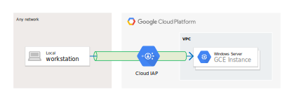
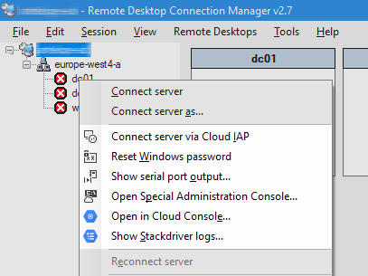
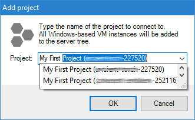
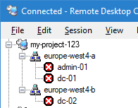

# Google Cloud IAP for Remote Desktop

Google Cloud IAP for Remote Desktop is a plugin for 
[Microsoft Remote Desktop Connection Manager](https://www.microsoft.com/en-us/download/details.aspx?id=44989)
that allows you to connect to VM instances running on Google Cloud via a
[Cloud IAP TCP forwarding](https://cloud.google.com/iap/docs/tcp-forwarding-overview) tunnel. 



When you click _Connect to server via Cloud IAP_, the plugin automatically creates a 
[Cloud IAP TCP forwarding](https://cloud.google.com/iap/docs/tcp-forwarding-overview) tunnel for 
you in the background and connects you to the remote desktop of the server. 



Using RDP over a Cloud IAP TCP forwarding has several key advantages:

* You can connect to VM instance that do not have a public IP address or NAT access to the internet.
* Because the TCP forwarding tunnel is established over HTTPS, you can connect even if your workstation
  is behind a corporate firewall or proxy.
* You can control who should be allowed to connect to a VM in a fine-grained manner by using 
  [Cloud IAM](https://cloud.google.com/iap/docs/using-tcp-forwarding#configuring_access_and_permissions).
* You do not need to expose RDP over the public internet. 

The plugin also adds a number of additional features to the Microsoft Remote Desktop Connection Manager
GUI which make working with Windows VMs on Google Cloud more convinient:

* _Generate Windows logon credentials_ 
  lets you create a user and [generates a password for a Windows VM instance](https://cloud.google.com/compute/docs/instances/windows/creating-passwords-for-windows-instances) 
  and saves the credentials in RDCMan. If a Windows account does not exist on the instance yet, 
  the command will create a new local Administrator account, otherwise it will reset the
  password of the existing account. 
  This feature requires the _Compute Engine Admin_ role in GCP.
* _Show serial port output_ tails the [serial port output](https://cloud.google.com/compute/docs/instances/viewing-serial-port-output)
  of an instance. This feature allows you to observe the boot process or analyze startup issues.
* _Open in Cloud Console_ takes you to the instance details in the Cloud Console.
* _Show Stackdriver logs_ takes you to the logs of the VM instance.


## Installation

### Installing the plugin

1. Make yure you have [Microsoft Remote Desktop Connection Manager](https://www.microsoft.com/en-us/download/details.aspx?id=44989) 
   2.7 installed on your workstation.
1. Download and run the MSI installer. The installer will install the necessary DLLs into the 
   installation folder of RDCMan (Usually, that is 
  `C:\Program Files (x86)\Microsoft\Remote Desktop Connection Manager\` but the installer
   will automatically detect if you have installed RDCMan to a different location). 
2. Restart Microsoft Remote Desktop Connection Manager.
3. On first use, the plugin will prompt you to sign in using your Google credentials and grant the plugin access
   to your GCP projects.

### Preparing your GCP project for Cloud IAP access


#### Firewall rules

To enable Cloud IAP to establish a TCP tunnel between your local workstation and a VM instance,
Cloud IAP has to be able to access the RDP port of your VM instance. By default, the VPC firewall rules
do not permit such access. You therefore have to create a firewall rule that allows Cloud IAP to access
port 3389 (the RDP port) of all relevant instances.

When creating a firewall rule, you can rely on the fact that Cloud IAP 
[always uses a source IP from the range](https://cloud.google.com/iap/docs/using-tcp-forwarding) 
`35.235.240.0/20`.

To allow Cloud IAP to access the RDP port of all VM instances in your VPC, run the following
command in Cloud Shell:

```
gcloud compute firewall-rules create allow-rdp-ingress-from-iap \
    --direction=INGRESS \
    --action=allow \
    --rules=tcp:3389 \
    --source-ranges=35.235.240.0/20 \
    --network=[YOUR-VPC]
```

Replace `[YOUR-VPC]` by the name of your VPC network.

Although `35.235.240.0/20` looks like an external IP address range, Cloud IAP will access your VM over
its internal IP address. VM instances do not need an external IP address for Cloud IAP
TCP tunneling to work.

#### IAM policies

By default, only _Project Owners_ are allowed to use Cloud IAP TCP tunneling to access 
VM instances. To allow other users to use Cloud IAP TCP tunneling, adjust the IAM policy 
of your project:

1. In the Cloud Console, go to **Security** > **Identity-Aware Proxy**
2. Select the **SSH and TCP forwarding** tab
3. Select the servers you want to grant access to
4. In the info panel, add the user and assign the **IAP-secured Tunnel User** role.

### Using the plugin

1. In RDCMan, select **Cloud IAM** > **Add project...** in the main menu.
2. In the project picker dialog, type the name or ID of the project to add, then click **OK**.

   
3. A new server group containing all Windows VMs of the selected project is automatically 
   added to the server tree:

   

4. Righ-click a server and click _Connect server via Cloud IAP_. This works like _Connect server_,
   but it will establish the connection via a Cloud IAP TCP tunnel. Therefore, this option will 
   work even if you are in a public network.

All existing RDCMan features are still available and you can choose whether to connect via Cloud IAP
or directly on a server-by-server basis.

## Troubleshooting


**Error "Timeout waiting for TCP tunnel to be created. Check that the respective VM 
instance permits RDP ingress traffic from Cloud IAP."**

1. Verify that your VPC permits ingress traffic from Cloud IAP as described in the
   previous section.
2. Check that your firewall rules allow TCP ingress traffic to port 3389 of your
   VM instance.


**Error "The WebSocket protocol is not supported on this platform."**

Windows 7 and Windows Server 2008 have limited support for Web Sockets, so you have to 
configure the plugin to use gcloud instead of the the builtin tunneling implemenation:

1. If you have not installed the Cloud SDK yet, 
   [download and install it first](https://cloud.google.com/sdk/docs/downloads-interactive).
2. In RDCMan, select **Tools** > **Cloud IAP Settings**
3. Set **Tunneling implementation** to **Gcloud**
4. Click **OK**
5. Restart RDCMan any try connecting again.

*Note:* When you use gcloud for tunneling, the connection will be established using the
gcloud credentials. These credentials might be different than the ones you used to 
authorize the plugin. Run `gcloud auth login` to change the credentials used by gcloud.


**Error "gcloud failed to create IAP tunnel"** with details 
**Insufficient Permission: Request had insufficient authentication scopes.**

gcloud does not have sufficient rights to establish a IAP TCP tunnel to the VM instance.

1. Run `gcloud auth list` to verify that gcloud is using the right account.
2. If necessary, run `gcloud auth login` to change the credentials used by gcloud.
3. Verify that the IAP policy of your GCP project permits IAP tunneling access to the VM.

**Desktop firewall warnings**

For each VM instance you connect to via Cloud IAP, the plugin opens a TCP
socket that listens on `127.0.0.1` (using a dynamic port number). This port
is necessary to relay the RDP traffic from the Remote Desktop component 
to Cloud IAP.

**Other errors**

If you are seeting other error messages, try manually establishing
a Cloud IAP TCP forwarding tunnel:

1. If you have not installed the Cloud SDK yet, 
   [download and install it first](https://cloud.google.com/sdk/docs/downloads-interactive).
2. Open a command prompt window (`cmd.exe`).
3. Run the following command: `gcloud compute start-iap-tunnel [INSTANCE_NAME] 3389 
  --project=[PROJECT] --zone=[ZONE] --local-host-port=localhost:13389`
   Replace `[INSTANCE_NAME]` by the name of an instance and `[PROJECT]` and `[ZONE]` by 
   the project and zone the instance is located in.
4. Wait for the output `Listening on port [13389].` to appear.
5. Launch `mstsc.exe` and try to connect to `localhost:13389`.

If establishing the tunnel does not work, check if a local firewall is blocking `gcloud`
from binding to a local port or blocking communication with Cloud IAP.


## Building the plugin

To build the plugin, check out the [prerequisites](BUILDING.md).

## Privacy

This plugin accesses Google Cloud Platform in order to:

* establish Cloud IAP TCP tunnels to VM instances
* list VMs and obtain metadata and logs for VM instances  
* generate Windows logon credentials if requested

The plugin uses the following APIs for this purpose:

* [Compute Engine API](https://cloud.google.com/compute/docs/reference/rest/v1/)
* [Google OAuth](https://developers.google.com/identity/protocols/OAuth2)

When you use the plugin for the first time, you have to authorize it to 
access your Google Cloud Platform resources on your behalf. The plugin
maintains an OAuth refresh token that allows it to re-authenticate 
automatically the next time you use it. The refresh token
is encrypted by using DPAPI and stored in the registry. You can revoke
your authorization at any time by selecting **Cloud IAP > Sign out**
in the menu.

Alternatively, you can instruct the plugin to use your locally saved gcloud credentials.
See [Authorizing Cloud SDK tools](https://cloud.google.com/sdk/docs/authorizing) 
for further details on how gcloud credentials are managed.

The plugin does not disclose or transmit any user data to APIs other than the
ones listed above. For data transmitted by gcloud, refer to the
[product documentation](https://cloud.google.com/sdk/usage-statistics).

## Support

This is not an officially supported Google product.

## License

All files in this repository are under the
[Apache License, Version 2.0](LICENSE.txt) unless noted otherwise.
