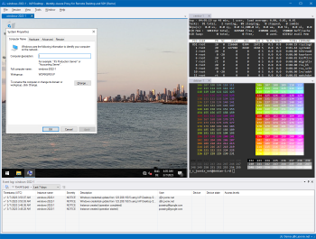
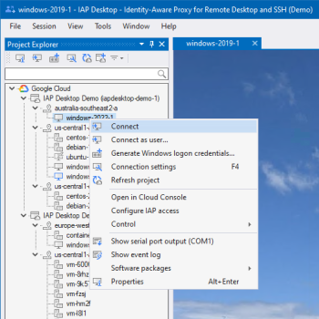

# IAP Desktop

IAP Desktop is a Remote Desktop and SSH client that lets you connect to your Google Cloud VM instances from anywhere.

<a href='https://github.com/GoogleCloudPlatform/iap-desktop/releases/latest/download/IapDesktopX86.msi'>x86 (32-bit)</a> | 
<a href='https://github.com/GoogleCloudPlatform/iap-desktop/releases/latest/download/IapDesktopX64.msi'>x64 (64-bit)</a>. 
For Windows 11/10/8.1. No admin rights required.

## Access Linux and Windows VMs from anywhere

IAP Desktop uses [Identity-Aware-Proxy (IAP)](https://cloud.google.com/iap/docs/tcp-forwarding-overview) to connect to VM instances so that you can:

*   Connect to VM instances that don’t have a public IP address
*   Connect from anywhere over the internet

Together, IAP Desktop and [Identity-Aware-Proxy (IAP)](https://cloud.google.com/iap/docs/tcp-forwarding-overview) let you apply zero-trust security to your VMs:

*   Apply fine-grained access controls that define [who can access which VM](https://cloud.google.com/iap/docs/using-tcp-forwarding#configuring_access_and_permissions)
*   Use [access levels](https://cloud.google.com/iap/docs/cloud-iap-context-aware-access-howto) to restrict access by time or location
*   Use [BeycondCorp Enterprise](https://cloud.google.com/beyondcorp-enterprise) to limit access to trusted devices

The application automatically manages IAP TCP tunnels for you, and protects them so that no other users or programs can access them.

## Connect to Windows VMs with Remote Desktop

IAP Desktop is a [full-featured Remote Desktop client](https://googlecloudplatform.github.io/iap-desktop/connect-windows/) that lets you:

*   Use multiple Remote Desktop sessions at the same time
*   Switch between full-screen and tabbed Remote Desktop sessions
*   Upload and download files over SFTP

To help you authenticate to Windows VMs, IAP Desktop can:

*   Automatically generate Windows credentials by using the Compute Engine guest agent environment
*   Encrypt and store your Windows credentials locally

:arrow_forward: [Show screencast](doc/images/RemoteDesktop_1400.gif?raw=true)

## Connect to Linux VMs with SSH

IAP Desktop [includes an SSH client and terminal](https://googlecloudplatform.github.io/iap-desktop/connect-linux/) so that you can:

*   Use multiple SSH sessions in parallel, and switch between them using tabs
*   Upload and download files using SFTP

To help you authenticate to Linux VMs, IAP Desktop can:

*   Automatically create and publish SSH keys to [OS Login](https://cloud.google.com/compute/docs/oslogin) or [metadata](https://cloud.google.com/compute/docs/connect/add-ssh-keys#metadata)
*   Use OS Login [2-factor authentication](https://cloud.google.com/compute/docs/oslogin/set-up-oslogin)
*   Store our SSH keys locally using Windows CNG

:arrow_forward: [Show screencast](doc/images/SSH_1400.gif?raw=true)

## Manage VMs across projects

IAP Desktop gives you a consolidated view of your VMs and lets you:

*   Connect to VMs across multiple projects and Google Cloud organizations
*   [View diagnostics information](https://googlecloudplatform.github.io/iap-desktop/toolwindow-eventlog/)
    such as logs and serial port output
*   Remotely join a VM to Active Directory 
*   Perform other common operations such as starting or stopping VMs

:arrow_forward: [Show screencast](doc/images/Manage_1400.gif?raw=true)

## Connect to SQL Server and other server applications

You can use IAP Desktop to let client applications connect to your Google Cloud VMs through IAP:
Right-click a VM, select the application to launch, and IAP Desktop automatically connects the
application through an IAP TCP forwarding tunnel. 

Supported client applications include:

*   [SQL Server Management Studio](https://googlecloudplatform.github.io/iap-desktop/connect-sqlserver/) (supporting Windows authentication and SQL Server authentication)
*   MySQL Shell
*   Chrome (to connect to management portals and other internal websites)
*   [Custom applications](https://googlecloudplatform.github.io/iap-desktop/client-application-configuration/)

## Learn more about IAP Desktop

### Get started

*   [Install IAP Desktop](https://googlecloudplatform.github.io/iap-desktop/install/)
*   [Configure IAP in your project](https://googlecloudplatform.github.io/iap-desktop/setup-iap/)
*   [Connect to a Windows VM](https://googlecloudplatform.github.io/iap-desktop/connect-windows/)
*   [Connect to a Linux VM](https://googlecloudplatform.github.io/iap-desktop/connect-linux/)
*   [Connect to SQL Server](https://googlecloudplatform.github.io/iap-desktop/connect-sqlserver/)
*   [Connect to VMs from within a web browser](https://googlecloudplatform.github.io/iap-desktop/connect-by-url/)

### Use the tool windows

*   [Instance properties](https://googlecloudplatform.github.io/iap-desktop/toolwindow-instance-properties/)
*   [Event log](https://googlecloudplatform.github.io/iap-desktop/toolwindow-eventlog/)
*   [Serial port output](https://googlecloudplatform.github.io/iap-desktop/toolwindow-serial-port-output/)

### Customize IAP Desktop

*   [Create profiles](https://googlecloudplatform.github.io/iap-desktop/create-profiles/)

### Administer IAP Desktop

*   [Use group policies](https://googlecloudplatform.github.io/iap-desktop/group-policies/)
*   [Troubleshoot common issues](https://googlecloudplatform.github.io/iap-desktop/troubleshooting/)

_IAP Desktop is an open-source project developed and maintained by the Google Cloud Solutions Architects team. The project is not an officially supported Google product._

_All files in this repository are under the
[Apache License, Version 2.0](LICENSE.txt) unless noted otherwise._
