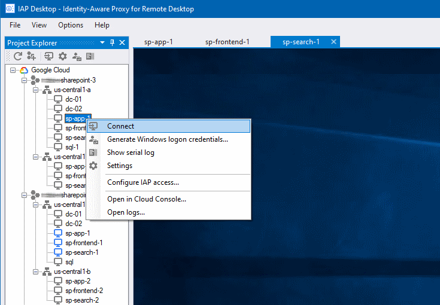

# IAP Desktop

IAP Desktop is a Windows application that allows you to manage multiple Remote Desktop connections 
to Windows VM instances that run on Google Cloud. 

To increase security and flexibility, IAP Desktop uses 
[Identity-Aware-Proxy TCP tunneling](https://cloud.google.com/iap/docs/tcp-forwarding-overview) to 
connect to VM instance, combining the convenience of a Remote
Desktop connection manager with the advantages of Identity-Aware-Proxy:

* You can connect from anywhere, not only from selected networks
* You can connect to VM instances that not expose RDP publicly or do not have a public IP address
* You can exert fine-grained control which users and which devices should be allowed to access which VM instances

[Download IAP Desktop](/GoogleCloudPlatform/iap-windows-rdc-plugin/releases) <!-- and learn more about [installing](Installation) and [using IAP Desktop](Quickstart). -->

_IAP Desktop is an open-source project and not an officially supported Google product._

_All files in this repository are under the
[Apache License, Version 2.0](LICENSE.txt) unless noted otherwise._
