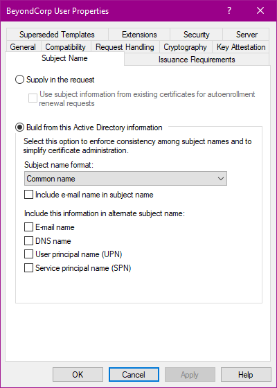
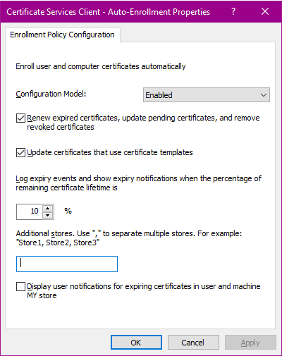

## Deploy a certificate to client workstations

The steps to deploy a certificate to client workstations depends on the type
of public key infrastructure you use.

=== "Active Directory Certificate Services"

    You can configure Active Directory Certificate Services (AD CS) to automatically
    issue and distribute certificates to users by doing the following:
    
    *   Create a certificate template for a user certificate that permits
        client authentication.
    *   Set up auto-enrollment so that AD CS automatically issues certificates
        to users.

    To create a certificate template, do the following:

    { width="250", align=right }

    1.  Open the **Certificate Templates** MMC snap-in.
    1.  Right-click the **User** template and select **All tasks > Duplicate template**.
        
    1.  On the **Compatibility** tab, configure the following settings:

        *   **Certificate authority**: **Windows Server 2012** or a later version
        *   **Certificate recipient**: **Windows 8/Windows Server 2012** or a later version
        
    1.  On the **General** tab, configure the following settings:

        *   **Template display name**: Enter a name such as `BeyondCorp User`
        
    1.  On the **Request handling** tab, configure the following settings:
    
        *   **Allow private key to be exported**: **disabled**
        
    1.  On the **Cryptography** tab, configure the following settings:

        *   **Provider category**: **Key Storage Provider**

    1.  On the **Subject name** tab, select **Build from Active Directory information** and 
        configure the following settings:

        *   **Subject name format**: **Common name**
        *   **Include e-mail name in subject name**: **disabled**
        *   **E-mail name**: **disabled**
        *   **DNS name**: **disabled**
        *   **User principal name**: **disabled**
        *   **Service principal name**: **disabled**
    
        These settings help limit the risk of bad actors abusing the certificate for other purposes
        such as smart card authentication. 
        
        For further details on how Windows determines whether
        a certificate can be used for smart card authentication, see 
        [Client certificate mappings :octicons-link-external-16:](https://learn.microsoft.com/en-us/previous-versions/windows/it-pro/windows-server-2008-R2-and-2008/ff404289(v=ws.10)#client-certificate-mappings).
        For additional ways to mitigate risks, see [How to disable the Subject Alternative Name for UPN mapping :octicons-link-external-16:](https://learn.microsoft.com/en-us/troubleshoot/windows-server/windows-security/disable-subject-alternative-name-upn-mapping).
    
    1.  On the **Extensions** tab, select **Application Policies** and click **Edit**.
        Then configure the following settings:

        *   **Application policies**: **Client authentication**
        
            Remove all other policies.
            
    1.  On the **Security** tab, select one or more groups that you want to
        distribute the certificate to. Grant each group the following permissions:
        
        *   Read
        *   Enroll
        *   Autoenroll

    1.  Optionally, adjust other settings such as certificate validity.
    1.  Click **OK**.
    1.  Open the **Certificate Authority** MMC snap-in.
    1.  Right-click the **Certificate Template** folder and select **New > Certificate template to issue**.
    1.  Select the certificate template that you created in the previous step and click **OK**.
    
    To set up auto-enrollment, create a new group policy object (GPO):

    1.  Open the **Group Policy Management Console** MMC snap-in.
    1.  Select the organizational unit that contains the user accounts for which you want to
        enable auto-enrollment.
    1.  Right-click the organizational unit and select **Create GPO in this domain and link it here**.
    1.  In the **New GPO** dialog, enter a name such as `BeyondCorp certificate enrollment`  and click **OK**.
    1.  Right-click the GPO and select **Edit**.

    To set up auto-enrollment, configure the GPO as follows:

    { width="250", align=right }

    1.  Navigate to **User Configuration > Policies > Windows Settings > Security settings > Public key policies**
    1.  Open the **Certificate Services Client - Auto-Enrollment** policy.
    1.  Configure the following settings:

        *   **Configuration model**: **Enabled**.
        *   **Renew expired certificates, update pending certificates, and remove revoked certificates**: **enabled**
        *   **Update certificates that use certificate templates**: **enabled**
        
    1.  Click **OK**.

    It might take some time before the group policy takes effect on user's workstations. To force
    a group policy refresh, run `gpupdate /force`.

=== "Endpoint verification"

    TODO

## Configure certificate selection

TODO: GPO with AutoSelect

!!! note

    If you use EV, you can skip this step.

=== "Google Chrome ADMX"
=== "Registry setting"

## Create an access level

## Apply the access level

=== "IAM conditions"

=== "Groups"

=== "VPC-SC ingress"

!!! note

    Remove Owner role