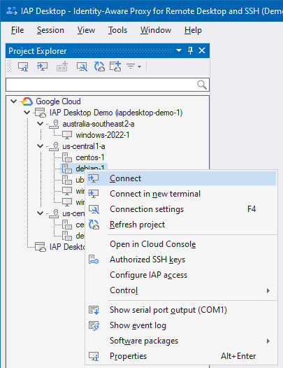
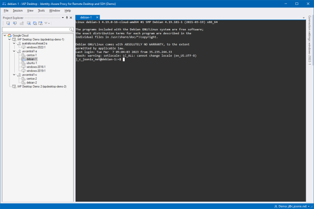
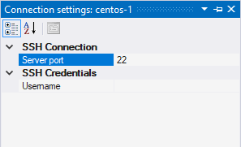

???+ info "Required roles"

    To follow the steps in this guide, you need the following roles:
    
    *   [ ] [Compute Viewer :octicons-link-external-16:](https://cloud.google.com/compute/docs/access/iam) on the project.
    *   [ ] [IAP-Secured Tunnel User :octicons-link-external-16:](https://cloud.google.com/iap/docs/managing-access#roles) on
        the project or VM.
    
    Depending on the configuration of your VM, you might also need:
    
    *   [ ] [Compute OS Login :octicons-link-external-16:](https://cloud.google.com/compute/docs/access/iam#compute.osLogin)
        (if OS Login is enabled) or 
        [Compute Instance Admin :octicons-link-external-16:](https://cloud.google.com/compute/docs/access/iam) (if OS Login is disabled)
        on the project or VM.
    *   [ ] [Service Account User :octicons-link-external-16:](https://cloud.google.com/compute/docs/access/iam#iam.serviceAccountUser) 
        on the project or VM (if the VM has an attached service account).

To connect to a Linux VM by using SSH, do the following:

1. In the **Project Explorer** tool window, right-click a VM instance and select **Connect**:

   

 1. IAP Desktop now [automatically publishes your SSH public key :octicons-link-external-16:](https://cloud.google.com/compute/docs/instances/access-overview#managing_user_access), 
    creates an [IAP TCP forwarding tunnel](https://cloud.google.com/iap/docs/using-tcp-forwarding :octicons-link-external-16:), and
    opens a terminal:
   
    

## Customize connection settings

To customize the connection settings, you can use the **Connection Settings** tool window:

1.  In the **Project Explorer** tool window, right-click a VM instance and select **Connection Settings**.
1.  In the **Connection Settings** window, customize settings as needed. 

    

    If you specify a setting
    that deviates from the default, it is shown in bold typeface.

Instead of customizing settings for each VM instance individually, you can also specify settings that apply to 
an entire zone or projects:

1.  In the **Project Explorer** tool window, right-click a zone or project and select **Connection Settings**.
1.  In the **Connection Settings** window, customize settings as needed. The settings apply to all VM instances
    in the respective zone or project, unless explicitly overridden.

For more information about customizing connection settings, see [Connection settings](toolwindow-connection-settings.md).

## Frequently Asked Questions

### Which SSH key does IAP Desktop use for authentication?

By default, IAP Desktop uses [a ECDSA NISTP-256 key pair for SSH public key authentication](ssh-algorithms.md).
The key is created automatically on first use, is managed using the
[Microsoft Software Key Storage Provider :octicons-link-external-16:](https://docs.microsoft.com/en-us/windows/win32/seccertenroll/cng-key-storage-providers#microsoft-software-key-storage-provider),
and is not exportable.

For more details, see [Security & privacy](security.md).

### Can I use an existing private key instead?

No, IAP Desktop maintains its own RSA key pair. But Google Cloud lets you use multiple 
SSH keys, so you can continue to use your existing private key for other SSH clients.

## What's next

*   [Troubleshoot](troubleshooting.md) common issues
*   See how you can [connect to Windows VMs by using Remote Desktop](connect-windows.md)
*   Learn how you can [connect to SQL Server](connect-sqlserver.md)
