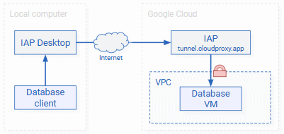
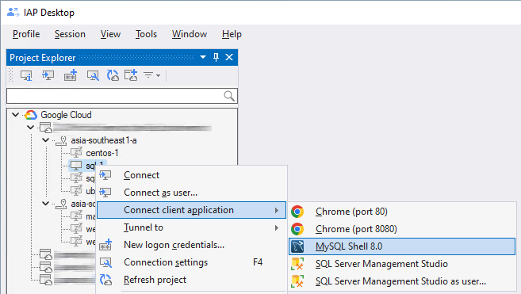
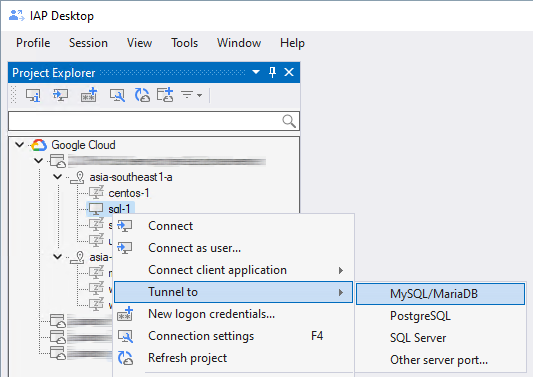
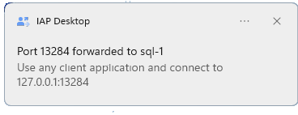

# Access MySQL, MariaDB, or PostgreSQL

???+ info "Required roles"

    To follow the steps in this guide, you need the following roles:
    
    *   [ ] [Compute Viewer :octicons-link-external-16:](https://cloud.google.com/compute/docs/access/iam) on the project.
    *   [ ] [IAP-Secured Tunnel User :octicons-link-external-16:](https://cloud.google.com/iap/docs/managing-access#roles) on
        the project or VM.
               

???+ success "Prerequisites"

    To follow the steps in this guide, make sure that you meet the following prerequisites:

    *   You downloaded and installed a database client such as MySQL Shell, PostgreSQL Shell, or pgAdmin on your
        local computer.
    *   You [created a firewall rule](setup-iap.md) that allows IAP to connect to port <code>3306</code> (MySQL, MariaDB)
        or port <code>5432</code> (PostgreSQL) of the database VM.

You can use IAP Desktop to access MySQL, MariaDB, or PostgreSQL in two ways:

1.  You can let IAP Desktop launch and [connect the database client](#connect-a-client-application)
    for you. IAP Desktop automatically establishes an
    [IAP TCP forwarding tunnel :octicons-link-external-16:](https://cloud.google.com/iap/docs/using-tcp-forwarding)
    and keeps the tunnel open until you close the client application.

    This is the most convenient option, but it only works for client applications that allow
    connection details (server name, port number) to be passed as a command line parameter. These include
    the command-line clients for MySQL, MariaDB, and PostgreSQL, but not MySQL Workbench or pgAdmin.

1.  You can let IAP Desktop [open a tunnel](#open-a-tunnel). You can then use any tool to
    connect to that tunnel and the tunnel remains open until you close IAP Desktop.

    This option is slightly less convenient, but works with most client applications, including MySQL Workbench and pgAdmin.

The way IAP Desktop uses IAP-TCP to connect to MySQL, MariaDB, or PostgreSQL differs depending on
whether you're running the database on Compute Engine or using Cloud SQL:

=== "Compute Engine"
    
    If you're running MySQL, MariaDB, or PostgreSQL on Compute Engine, you don't need any additional VM to
    let IAP Desktop connect to the database. The only prerequisite is 
    [a firewall rule](setup-iap.md) that allows IAP-TCP to connect to
    port <code>3306</code> (MySQL, MariaDB)
    or port <code>5432</code> (PostgreSQL) of the database VM.
    
    

=== "Cloud SQL"
    
    If you're using Cloud SQL for MySQL or PostgreSQL, you need an additional VM that runs the
    [Cloud SQL Auth Proxy :octicons-link-external-16:](https://cloud.google.com/sql/docs/mysql/sql-proxy). This VM is necessary
    because IAP-TCP doesn't support creating tunnels to managed services such as Cloud SQL.
    
    

    To deploy a Cloud SQL Auth Proxy VM, see [Set up a Cloud SQL Proxy VM](setup-cloudsql.md).

## Connect the database client

To launch and connect a client application automatically, do the following:

=== "MySQL Shell"

    1.  In the **Project Explorer** tool window, right-click your database VM and select 
        **Connect client application > MySQL Shell**.
       
        { width="400" }
       
        !!! note
       
            If you don't see the menu entry, then IAP Desktop wasn't able to
            find a supported version of the MySQL command-line client on your computer.

    1.  IAP Desktop now creates an [IAP TCP forwarding tunnel :octicons-link-external-16:](https://cloud.google.com/iap/docs/using-tcp-forwarding) and
        launches the MySQL command-line client.

=== "PostgreSQL Shell"

    1.  In the **Project Explorer** tool window, right-click your database VM and select 
        **Connect client application > PostgreSQL Shell**.
       
        !!! note
       
            If you don't see the menu entry, then IAP Desktop wasn't able to
            find a supported version of the PostgreSQL command-line client on your computer.

    1.  IAP Desktop now creates an [IAP TCP forwarding tunnel :octicons-link-external-16:](https://cloud.google.com/iap/docs/using-tcp-forwarding) and
        launches the PostgreSQL command-line client.

=== "Custom"

    You can register additional database clients by 
    [creating an IAP Application Protocol Configuration (IAPC)](client-application-configuration.md).

## Open a tunnel

You can let IAP Desktop open a tunnel and connect to the tunnel by doing the following:

=== "MySQL Workbench"

    1.  In the **Project Explorer** tool window, right-click your database VM and select 
        **Tunnel to > MySQL/MariaDB**.

        { width="400" }

        A notification appears:

        { width="300" }

    1.  Launch MySQL Workbench.
    1.  In MySQL Workbench, go to **Database > Connect to database**.
    1.  In the **Connect to database** dialog, configure the following:

        *   **Hostname**: `127.0.0.1`
        *   **Port**: Enter the port number indicated in the notification.

    1.  Click **OK**.

=== "pgAdmin"

    1.  In the **Project Explorer** tool window, right-click your database VM and select 
        **Tunnel to > PostgreSQL**.

        A notification appears:

        { width="300" }

    1.  Launch pgAdmin.
    1.  Click **Add new server**.
    1.  In the **Register server** dialog, enter a name for the server.
    1.  Switch to the **Connection** tab and configure the following:

        *   **Host name/address**: `127.0.0.1`
        *   **Port**: Enter the port number indicated in the notification.

    1.  Click **Save**.

=== "Custom"

    You can register additional database clients by 
    [creating an IAP Application Protocol Configuration (IAPC)](client-application-configuration.md).

To view all active tunnels and their port numbers, select **View > Active IAP tunnels** in the main menu.

!!! note

    When you open a tunnel to the same VM again in the future, IAP Desktop
    will use the same port number unless it's in use by a different application.

