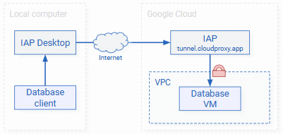
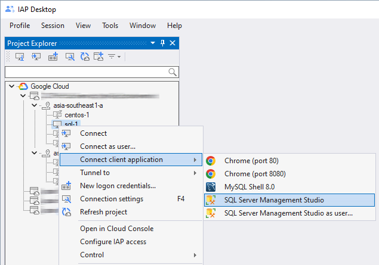

# Access SQL Server

???+ info "Required roles"

    To follow the steps in this guide, you need the following roles:
    
    *   [ ] [Compute Viewer :octicons-link-external-16:](https://cloud.google.com/compute/docs/access/iam) on the project.
    *   [ ] [IAP-Secured Tunnel User :octicons-link-external-16:](https://cloud.google.com/iap/docs/managing-access#roles) on
        the project or VM.
               

???+ success "Prerequisites"

    To follow the steps in this guide, make sure that you meet the following prerequisites:

    *   You downloaded and installed [SQL Server Management Studio (SSMS) :octicons-link-external-16:](https://learn.microsoft.com/en-us/sql/ssms/download-sql-server-management-studio-ssms) on your computer.
    *   You [created a firewall rule](setup-iap.md) that allows IAP to connect to port <code>1433</code> of your SQL Server VM.

You can use IAP Desktop to access SQL Server in two ways: 

1.  You can let IAP Desktop launch and [connect SQL Server Management Studio](#connect-sql-server-management-studio)
    (SSMS) for you. IAP Desktop automatically establishes an
    [IAP TCP forwarding tunnel :octicons-link-external-16:](https://cloud.google.com/iap/docs/using-tcp-forwarding)
    and keeps the tunnel open until you close SSMS.

1.  You can let IAP Desktop [open a tunnel](#open-a-tunnel). You can then use any tool to
    connect to that tunnel and the tunnel remains open until you close IAP Desktop.

The way IAP Desktop uses IAP-TCP to connect to SQL Server differs depending on
whether you're running SQL Server on Compute Engine or using Cloud SQL for SQL Server:

=== "Compute Engine"
    
    If you're running SQL Server on Compute Engine, you don't need any additional VM to
    let IAP Desktop connect to SQL Server. The only prerequisite is 
    [a firewall rule](setup-iap.md) that allows IAP-TCP to connect to
    port <code>1433</code> of your SQL Server VM.
    
    

=== "Cloud SQL"
    
    If you're using Cloud SQL for SQL Server, you need an additional VM that runs the
    [Cloud SQL Auth Proxy :octicons-link-external-16:](https://cloud.google.com/sql/docs/mysql/sql-proxy). This VM is necessary
    because IAP-TCP doesn't support creating tunnels to managed services such as Cloud SQL.
    
    

    To deploy a Cloud SQL Auth Proxy VM, see [Set up a Cloud SQL Proxy VM](setup-cloudsql.md).

## Connect SQL Server Management Studio

The steps to let IAP Desktop launch and connect SQL Server Management Studio (SSMS) differ depending
on how you want to authenticate to SQL Server:

=== "Windows authentication"

    To access SQL Server and authenticate using 
    [Windows authentication :octicons-link-external-16:](https://learn.microsoft.com/en-us/sql/relational-databases/security/choose-an-authentication-mode#connecting-through-windows-authentication), 
    do the following:

    1.  In the **Project Explorer** tool window, right-click your SQL Server VM and select 
        **Connect client application > SQL Server Management Studio**:
      
        { width="400" }
    
    1.  IAP Desktop now creates an [IAP TCP forwarding tunnel :octicons-link-external-16:](https://cloud.google.com/iap/docs/using-tcp-forwarding) and
        opens SQL Server Management Studio. 
        
        If your connection settings contain Windows credentials, SQL Server Management Studio automatically 
        authenticates you to SQL Server using Windows authentication.
        
        If you haven't configured Windows credentials yet, you can enter credentials manually:
        
        { width="400" }
        
        ???+ Note
        
            You can use Windows authentication even if your local computer isn't domain-joined, or
            joined to a different Active Directory domain than the SQL Server VM.

        IAP Desktop now launches SSMS and connects it to the VM:

    1.  You can now use SSMS to interact with SQL Server:

        

=== "SQL authentication"

    To access SQL Server and authenticate using SQL authentication, do the following:

    1.  In the **Project Explorer** tool window, right-click your SQL Server VM and select
        **Connection settings**.
    
    1.  In the **Connection settings** window, set **SQL Server > Windows authentication** to **disabled**.
    
    1.  In the **Project Explorer** tool window, right-click your SQL Server VM and select 
        **Connect client application > SQL Server Management Studio**:
      
        { width="400" }
    
    1.  Enter your SQL Server username and click **OK**.

        IAP Desktop now launches SSMS. If this is the first time you're connecting to this VM,
        you might see an error message indicating that the login failed because you haven't 
        provided a password. Dismiss the error message and use the SQL Server login dialog 
        to complete authentication.
    
## Open a tunnel

To let IAP Desktop open a tunnel to SQL Server, do the following:

1.  In the **Project Explorer** tool window, right-click your SQL Server VM and select 
    **Tunnel to > SQL Server**.

    { width="400" }

    A notification appears:

    { width="300" }

1.  Use any tool to connect to the tunnel using the port number indicated in the notification.

    !!! note

        When you open a tunnel to the same VM again in the future, IAP Desktop
        will use the same port number unless it's in use by a different application.

To view all active tunnels and their port numbers, select **View > Active IAP tunnels** in the main menu.

## Customize connection settings

To customize the connection settings, you can use the **Connection Settings** tool window:

1.  In the **Project Explorer** tool window, right-click the SQL Server VM and select **Connection Settings**.
1.  In the **Connection Settings** window, you can save your Windows credentials or switch to
    [SQL Server authentication :octicons-link-external-16:](https://learn.microsoft.com/en-us/sql/relational-databases/security/choose-an-authentication-mode#connecting-through-sql-server-authentication):

    

    If you specify a setting
    that deviates from the default, it is shown in bold typeface.

Instead of customizing settings for each VM instance individually, you can also specify settings that 
[apply to an entire zone or project](toolwindow-connection-settings.md).

## What's next

*   See how you can [connect to Windows VMs by using Remote Desktop](connect-windows.md)
*   Learn how you can [connect to Linux VMs by using SSH](connect-linux.md)