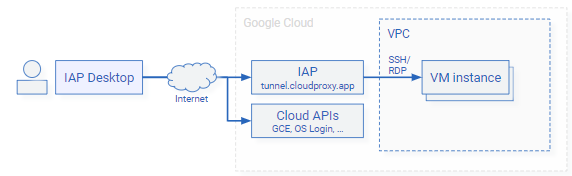
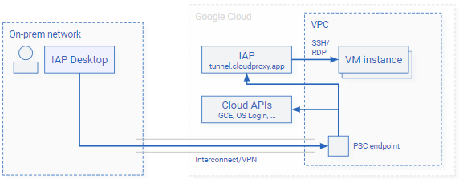

# Connect to Google Cloud

To let you connect to your VM instances, IAP Desktop must interact with Google Cloud APIs. You can configure
IAP Desktop to access Google Cloud APIs via the public internet or through hybrid connectivity.

## Connect via public internet

By default, IAP Desktop connects to your Google Cloud resources via the public internet:

If you've configured Windows to use a proxy server for HTTPS connections, then 
IAP Desktop automatically applies these settings. Alternatively, you can
[configure proxy settings manually](proxy-configuration.md) or 
using a [group policy](group-policies.md).

## Connect through Private Service Connect

!!! note

    This feature requires IAP Desktop 2.38
    
If your workstation is connected to an on-premises network that has
[hybrid connectivity to Google Cloud](https://cloud.google.com/hybrid-connectivity),
you can optionally let IAP Desktop connect to Google Cloud APIs through 
[Private Service Connect (PSC)](https://cloud.google.com/vpc/docs/about-accessing-google-apis-endpoints):

When you use PSC, connections to Google Cloud APIs traverse your Cloud Interconnect/VPN link
and bypass local proxy servers. You don't need to create any custom DNS records.

To configure PSC, do the following:

1.  [Create a PSC endpoint in your VPC :octicons-link-external-16:](https://cloud.google.com/vpc/docs/configure-private-service-connect-apis).
1.  In IAP Desktop, go to **Tools > Options > Access** and configure the following settings:

    *   **Use Private Service Connect to connect to Google APIs**: **enabled**.
    *   **Endpoint**: Enter the IP address of the PSC endpoint that you created earlier. Alternatively,
        you can enter the DNS name `www-ENDPOINT.p.googleapis.com` where `ENDPOINT` is the name of the 
        PSC endpoint that you created earlier.
        
Alternatively, you can use [a group policy](group-policies.md) to configure Private Service Connect
for multiple users and workstations.

        
!!! note

    The Private Service Connect settings that you configure in IAP Desktop only affect IAP Desktop and
    have no impact on your browser or `gcloud`.
    