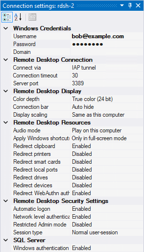

???+ info "Required roles"

    To follow the steps in this guide, you need the following roles:
    
    *   [ ] [Compute Viewer :octicons-link-external-16:](https://cloud.google.com/compute/docs/access/iam) on the project.
    *   [ ] [IAP-Secured Tunnel User :octicons-link-external-16:](https://cloud.google.com/iap/docs/managing-access#roles) on
        the project or VM.
        
    Optionally, to [create a Windows user account :octicons-link-external-16:](https://cloud.google.com/compute/docs/instances/windows/creating-passwords-for-windows-instances)
    on the VM, you also need the following role:
    
    *   [ ] [Compute Instance Admin :octicons-link-external-16:](https://cloud.google.com/compute/docs/access/iam) on the project or VM.
    *   [ ] [Service Account User :octicons-link-external-16:](https://cloud.google.com/compute/docs/access/iam#iam.serviceAccountUser) 
        on the project or VM (if the VM has an attached service account).
    

To connect to a Windows VM by using Remote Desktop (RDP), do the following:

1.  In the **Project Explorer** tool window, right-click a VM instance and select **Connect**:
    
    
    
1.  If this is the first time you connect to the VM instance, you'll see a prompt:
    
    
    
    *   Select **Generate new credentials** to 
        [create a Windows user account :octicons-link-external-16:](https://cloud.google.com/compute/docs/instances/windows/creating-passwords-for-windows-instances)
        on the selected VM instance and to connect using this account. 
        
        You only see this option if you have permission to generate Windows credentials.
    
    *   Select **Configure credentials** to jump to the **Connection Settings** tool window where you can
        specify and save Windows credentials. IAP Desktop will use these saved credentials in subsequent
        connection attempts.
        
    *   Select **Connect without configuring credentials** if you do not want to save any credentials. You will still
        see a credential prompt, but the username and password will not be saved for future use.
    
 1. IAP Desktop now automatically creates an [IAP TCP forwarding tunnel :octicons-link-external-16:](https://cloud.google.com/iap/docs/using-tcp-forwarding) and
    connects you to the Remote Desktop of the Windows VM:
    
    
    

## Customize connection settings

To customize the connection settings, you can use the **Connection Settings** tool window:

1.  In the **Project Explorer** tool window, right-click a VM instance and select **Connection Settings**.
1.  In the **Connection Settings** window, customize settings as needed. 

    

    If you specify a setting
    that deviates from the default, it is shown in bold typeface.

Instead of customizing settings for each VM instance individually, you can also specify settings that apply to 
an entire zone or projects:

1.  In the **Project Explorer** tool window, right-click a zone or project and select **Connection Settings**.
1.  In the **Connection Settings** window, customize settings as needed. The settings apply to all VM instances
    in the respective zone or project, unless explicitly overridden.

For more information about customizing connection settings, see [Connection settings](toolwindow-connection-settings.md).

## Frequently Asked Questions

### Do I need to install anything on the VM instance before I can connect?

IAP Desktop does not require any special configuration on VM instances other than
that Remote Desktop is enabled. All VM instances created using the 
[Google public images :octicons-link-external-16:](https://cloud.google.com/compute/docs/images) have
Remote Desktop enabled by default.

### Does IAP Desktop work for non-Administrator users?

To connect to a Windows VM by using Remote Desktop, you must have the 
[Allow log on through Remote Desktop Services :octicons-link-external-16:](https://docs.microsoft.com/en-us/windows/security/threat-protection/security-policy-settings/allow-log-on-through-remote-desktop-services) privilege on the VM. By default, only members of the local **Administrator** group have this privilege, but you can grant the privilege to other users by adding them to the **Remote Desktop 
Users** group.

### Do I need RDS CALs to use IAP Desktop?

You typically do not need CALs if you use IAP Desktop for server administration only. If you use IAP Desktop
for other purposes, or if need to support more than two concurrent connections, 
[you might need to purchase RDS CALs :octicons-link-external-16:](https://cloud.google.com/compute/docs/instances/windows/ms-licensing-faq#are_remote_desktop_services_rds_client_access_licenses_cals_required_for_on-demand_vm_instances).

### Does IAP Desktop support CALs issued by an RDS license server?

Yes.

### Can I use IAP Desktop with a Remote Desktop Gateway?

No, IAP Desktop currently doesn't support RDS.

## What's next

*   [Troubleshoot](troubleshooting.md) common issues
*   See how you can [connect to Linux VMs by using SSH](connect-linux.md)
*   Learn how you can [connect to SQL Server](connect-sqlserver.md)
