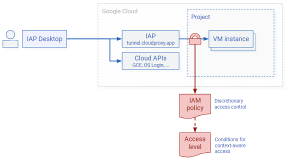
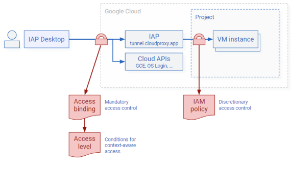
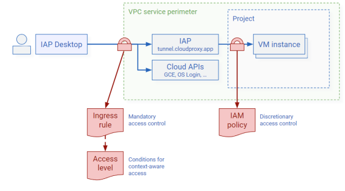

# Control access to VMs

IAP Desktop uses [IAP TCP-forwarding :octicons-link-external-16:](https://cloud.google.com/iap/docs/using-tcp-forwarding)
to connect to VM instances. IAP TCP-forwarding lets you configure fine-grained, IAM-based access to VM instances. 
Additionally, you can configure IAP to enforce context-aware access.

## IAM policies

Before IAP TCP-forwarding lets a user connect to a VM, it verifies that the user has one of the following roles:

*   _IAP-secured Tunnel User_ (`roles/iap.tunnelResourceAccessor`)
*   A custom role that includes the `iap.tunnelInstances.accessViaIAP` permission
*   _Owner_ (`roles/owner`)

!!! important

    To make sure users can't bypass IAP when attempting to access VM instances, you must 
    [configure your VPC's firewall rules so that they only allow ingress from IAP's IP range :octicons-link-external-16:](https://cloud.google.com/iap/docs/using-tcp-forwarding#create-firewall-rule).

## Context-aware access

When you grant a user permission to access a VM using IAP Desktop and IAP TCP-forwarding, then, by default, they can exercise that access 
from any device, network and location as long as they're authenticated and hold one of the required roles. 
While convenient for users, this level of access can increase risks 
as users might be connecting from compromised devices or untrusted networks.

To reduce risk, you can configure IAP TCP-forwarding so that users can only access VM instances from certain devices or locations. 
This is referred to a context-aware access.

Context-aware access distinguishes between policy definition and policy enforcement:

*   **Policy definition**: By using [Access Context Manager :octicons-link-external-16:](https://cloud.google.com/access-context-manager/docs/overview),
    you create one or more [access levels :octicons-link-external-16:](https://cloud.google.com/access-context-manager/docs/create-basic-access-level).
    Each access level contains a list of conditions. If a user meets all conditions, they're said to
    _satisfy the access level_.
    
    Basic access levels let you limit access by network or geo-location. As a BeyondCorp subscriber, you can also limit 
    access based on other attributes such as [credential strength :octicons-link-external-16:](https://cloud.google.com/access-context-manager/docs/create-credential-strength-policy), 
    [the configuration of the browser :octicons-link-external-16:](https://cloud.google.com/access-context-manager/docs/browser-attributes) 
    that’s used for authentication, or 
    [device posture :octicons-link-external-16:](https://cloud.google.com/access-context-manager/docs/create-custom-access-level).
        
    For example, you might create one access level that verifies that a user is based in a certain geo-location
    and another access level that requires a user to use a corporate device and managed browser.
    
*   **Policy Enforcement**: IAP can enforce context-aware access policies by verifying that a user
    satisfies a certain access level. IAP performs this check in addition to verifying that the 
    user holds one of the required IAM roles.
    

    There are multiple ways to configure IAP so that it enforces context-aware access checks:

    *   For VMs that aren't part of a [VPC service perimeter :octicons-link-external-16:](https://cloud.google.com/vpc-service-controls/docs/service-perimeters), 
        you can use [IAM conditions](#iam-conditions) or 
        [access bindings](#access-bindings) to 
        require users to satisfy a certain access level.
    *   For VMs that are part of a service perimeter, you can use 
        [ingress rules](#vpc-service-control-ingress-rules) to require users to satisfy a certain access level.

### IAM conditions

You can enforce context-aware access by creating an access level and assign it to individual IAM role bindings 
[by using IAM conditions :octicons-link-external-16:](https://cloud.google.com/iap/docs/cloud-iap-context-aware-access-howto#editing-iam-policy). 

Using IAM role bindings works best if you want to apply different policies to different sets of VMs.

!!! Note 

    You can’t apply IAM conditions to basic roles such as _Owner_ or _Editor_.

Managing access by using IAM policies is a form of
[discretionary access control :octicons-link-external-16:](https://en.wikipedia.org/wiki/Discretionary_access_control): Users
that have permission to modify the IAM policy of a VM instance or project can grant other users access, and they
can also modify or remove IAM conditions. If, as an administrator, you want to mandate that all access
should be subject to a certain access level, you can use access bindings instead.

### Access bindings

You can enforce context-aware access by creating an access level and assigning it to a group by using an access binding:

Access bindings are a form or identity-based policy and they apply to all resources that a user attempts 
to access. This includes IAP, [and also other APIs and the Cloud Console :octicons-link-external-16:](https://cloud.google.com/beyondcorp-enterprise/docs/securing-console-and-apis). 

Using access bindings works best if you want to ensure that context-aware access is uniformly enforced across resources.

### VPC service control ingress rules

For VMs that are part of a [VPC service perimeter :octicons-link-external-16:](https://cloud.google.com/vpc-service-controls/docs/service-perimeters),
IAP detects whether the user’s workstation is part of the same 
VPC service perimeter. That is the case if any of the following applies:

*   The source IP is the external IP address of a Compute Engine VM.
*   The connection is made through Private Google Access from a VM that’s part of the service perimeter.
*   The connection is made [through a Private Service Access access endpoint](connect-to-google-cloud.md) that’s part of the service perimeter.

If the user's workstation is outside the VPC service perimeter, IAP can enforce access based on 
[ingress rules](https://cloud.google.com/vpc-service-controls/docs/ingress-egress-rules) and access levels.

Granting users SSH or RDP access to a VM that’s part of a service perimeter can be risky because 
it might allow users to undermine your VPC service perimeter and exfiltrate data. Using IAP to enforce
context-aware access can be an effective way to mitigate this risk.
