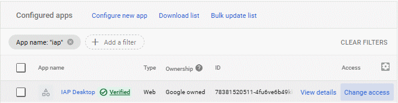

# Control session length

When you launch IAP Desktop, the application might prompt you to authenticate even if you've used the 
application before. Whenever you're prompted to authenticate again, it's because your Google Cloud session expired.

By default, Google Cloud sessions expire after 16 hours. This default was first 
[announced in March 2023 :octicons-link-external-16:](https://workspaceupdates.googleblog.com/2023/03/google-cloud-session-length-default-update.html) 
and has subsequently been applied to many Cloud Identity and Workspace accounts. If you experience authentication prompts 
more frequently than in the past, then this might be because your default settings have been changed.

## Balance security and usability

As a Cloud Identity or Workspace administrator, you can customize how Google Cloud enforces session length:

*   You can [change the maximum duration of a Google Cloud session :octicons-link-external-16:](https://support.google.com/a/answer/9368756?).
*   You can exempt individual apps from session length limits.

Shorter session lengths help you reduce the risk of token theft, especially if your organization uses tools such 
as `gcloud` which store authentication tokens on disk without encrypting them first. 

IAP Desktop [encrypts authentication tokens before storing them on disk](security.md) using the Windows DPAPI, which helps lower
the risk of token theft. The additional security afforded by on-disk encryption might let you justify exempting 
IAP Desktop from the Google Cloud session length control, applying a more lenient policy.

To exempt IAP Desktop from the Google Cloud session length control, you configure IAP Desktop as a 
[trusted app :octicons-link-external-16:](https://support.google.com/a/answer/7281227?#trustorlimit).

## Configure IAP Desktop as a trusted app

You can exempt IAP Desktop from the Google Cloud session length control by configuring it as a trusted app:

1.  In the Admin Console, go to **Security > Google Cloud session control**
1.  Check the status of the **Exempt trusted apps** setting.  
 
    If you've disabled this setting, configuring IAP Desktop as a trusted app won't have any impact on session 
    length. To proceed, you must enable the setting. 

1.  Go to **Security > Access and data controls > API Controls **and select  **Manage app access**.
1.  In the list of apps, find **IAP Desktop** and click **Change access**:

     
     
    If you don't see IAP Desktop in the list, do the following instead:

    1.  Click **Configure new app**
    1.  Enter `78381520511-4fu6ve6b49kknk3dkdnpudoi0tivq6jn.apps.googleusercontent.com` 
        and click **Search**.
        
        !!! note 
            `78381520511-4fu6ve6b49kknk3dkdnpudoi0tivq6jn.apps.googleusercontent.com` is the 
            client ID that identifies IAP Desktop.
        
    1.  Select **IAP Desktop**.

1.  On the **Scope** page, select an organizational unit (OU).  
 
    If you select the root OU, the change will affect all users. If you select a OU, the change will only affect users in that specific OU.
    
1.  On the **Access to Google data** page, do the following:
    1. Select **Trusted**.
    1. Verify that the checkbox **Exempt from having API access blocked by Context-Aware Access levels** is clear.
    1. Click **Next**.

1.  On the **Review** page, click **Change access**. 

The change might take a few minutes to take effect.