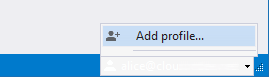
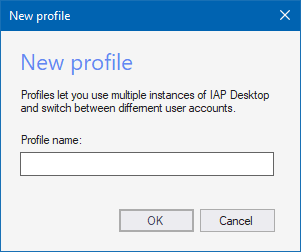
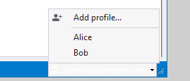

# Create profiles

If you have move than one Google account, you can use profiles to switch between your Google accounts. For each profile,
IAP Desktop maintains a separate set of settings.

## Add a profile

To add a profile, do the following:

1.  Click on your username in the status bar and select **Add profile**:

    

1.  Enter a name for the profile and click **OK**:

    

    A new instance of IAP Desktop opens, prompting you to sign in. The
    instance uses the newly created profile and any changes you make
    in this profile don't affect your other profiles.
    
## Switch between profiles

To switch between profiles, click on your username in the status bar and
select the profile you want to switch to.

You can use multiple profiles in parallel.

## Delete a profile

To delete a profile, do the following:

1.  Switch to the profile you want to delete.

1.  In the main menu, select **Profile > Sign out and exit**.

1.  When prompted whether you want to keep the profile, select **No**.

You can't delete the default profile.

## Use a different Google account

Although it's a good practice to use one profile per Google account, the
relationship between profiles and Google accounts isn't fixed: You can
modify a profile to use a different Google account by signing out and
signing in again:

1.  Switch to the profile you want to modify.

1.  In the main menu, select **Profile > Sign out and exit**.

1.  When prompted whether you want to keep the profile, select **Yes**.

The next time you switch to the profile, you're prompted to sign in again. You can now
sign in with a different Google account.

## What's next

*   See how you can [connect to Linux VMs by using SSH](connect-linux.md)
*   Learn how you can [connect to SQL Server](connect-sqlserver.md)