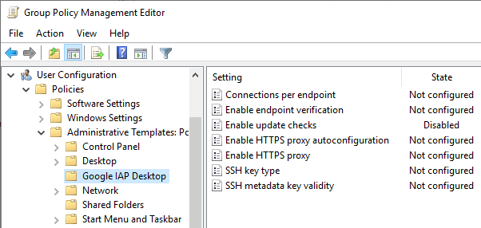

# Use group policies to customize IAP Desktop

You can use a group policy object (GPO) to configure policies for IAP Desktop. Policies take
precedence over user settings: When you configure a policy, users can't change the respective
setting anymore. 

For a full list of settings that you can control using group policies, see [Group policy reference](group-policy-reference.md).

To configure policies, you first have to install the IAP Desktop Policy Templates:

1.  Download the `PolicyTemplates` package from the [downloads page](https://github.com/GoogleCloudPlatform/iap-desktop/releases).
1.  Extract the package into the `PolicyDefinitions` folder of your 
    [central store :octicons-link-external-16:](https://docs.microsoft.com/en-us/troubleshoot/windows-server/group-policy/create-central-store-domain-controller).

You can now use the IAP Desktop Policy Templates to configure policies:

1.  In the **Group Policy Management Console**, create or select a GPO.
1.  Link the GPO to an organizational unit that contains the users who should be able to use IAP Desktop.

    Note: You can configure policies per-computer or per-user. Computer-based policies take precedence
    over user-based policies.

1.  Right-click the GPO and select **Edit**.
1.  Navigate to **User (or Computer) Configuration > Policies > Administrative Templates > Google IAP Desktop**
    and customize policies as necessary.

    

1.  Close the Group Policy Management Editor window.

## Customize server-side policies

To disallow clipboard sharing or restrict the usage of other Remote Desktop features, 
configure [group policies :octicons-link-external-16:](https://learn.microsoft.com/en-us/windows/client-management/mdm/policy-csp-remotedesktopservices)
on the target VM instance. You can configure these policies either by using the 
[Local Group Policy Editor](https://learn.microsoft.com/en-us/previous-versions/windows/it-pro/windows-server-2012-r2-and-2012/dn265982(v=ws.11))
or by using Active Directory to apply a group policy.

You can find Remote Desktop policies under 
**User (or Computer) Configuration > Policies > Administrative Templates > Windows Components > Remote Desktop Services > Remote Desktop Session Host**.