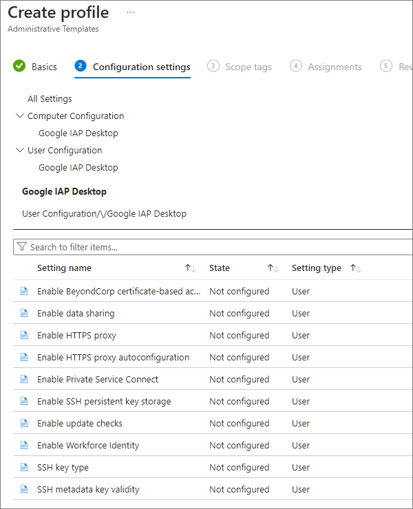

# Use group policies to customize IAP Desktop

You can use a group policy object (GPO) to configure policies for IAP Desktop. Group policies take
precedence over user settings: When you configure a group policy for a certain setting, 
users aren't allowed to change the respective setting. 

For a full list of settings that you can control using group policies, see [Group policy reference](group-policy-reference.md).

You can manage IAP Desktop group policies using Active Directory or Intune.

=== "Active Directory"

    Before you can configure a group policy, you must first install the IAP Desktop Policy Templates:
    
    1.  Download the `PolicyTemplates` package from the [downloads page](https://github.com/GoogleCloudPlatform/iap-desktop/releases).
    1.  Extract the package into the `PolicyDefinitions` folder of your 
        [central store :octicons-link-external-16:](https://docs.microsoft.com/en-us/troubleshoot/windows-server/group-policy/create-central-store-domain-controller).
    
    You can now use the IAP Desktop  templates to configure a group policy object:
    
    1.  In the **Group Policy Management Console**, create or select a GPO.
    1.  Link the GPO to an organizational unit that contains the users who should be able to use IAP Desktop.
    
        Note: You can configure policies per-computer or per-user. Computer-based policies take precedence
        over user-based policies.
    
    1.  Right-click the GPO and select **Edit**.
    1.  Navigate to **User (or Computer) Configuration > Policies > Administrative Templates > Google IAP Desktop**
        and customize policies as necessary.
    
        
    
    1.  Close the Group Policy Management Editor window.

=== "Intune"

    Before you can configure a configuration policy, you must first install the IAP Desktop Policy Templates:

    1.  In the [Intune admin center :octicons-link-external-16:](https://intune.microsoft.com/), go to
        **Devices > Configuration**.
    1.  Select the **Import ADMX** tab.
    1.  Import the following templates:

        *   **Windows.admx and Windows.adml**: You can find these files on your local computer in the
            `C:\Windows\PolicyDefinitions\` directory.

        *   **IapDesktop.admx and IapDesktop.adml**: You can find these files in the
            `PolicyTemplates` package from the [downloads page](https://github.com/GoogleCloudPlatform/iap-desktop/releases).
    
    You can now use the IAP Desktop templates to configure a configuration policy:

    1.  Select the **Policies** tab.
    1.  Click **Create > New policy** and select the following:

        +   **Platform**: **Windows 10 and later**
        +   **Profile type**: **Templates**
        +   **Template name**: **Imported Administrative templates**

    1.  Click **Create**.
    1.  On the **Create profile** page, you can now see the IAP Desktop settings:
    
        { width="400" }

    1.  Customize the policy as necessary and assign them to relevant groups.

## Use server-side group policies to customize Remote Desktop

To disallow clipboard sharing or restrict the usage of other Remote Desktop features, 
configure [group policies :octicons-link-external-16:](https://learn.microsoft.com/en-us/windows/client-management/mdm/policy-csp-remotedesktopservices)
on the target VM instance. You can configure these policies either by using the 
[Local Group Policy Editor](https://learn.microsoft.com/en-us/previous-versions/windows/it-pro/windows-server-2012-r2-and-2012/dn265982(v=ws.11))
or by using Active Directory to apply a group policy.

You can find Remote Desktop policies under 
**User (or Computer) Configuration > Policies > Administrative Templates > Windows Components > Remote Desktop Services > Remote Desktop Session Host**.