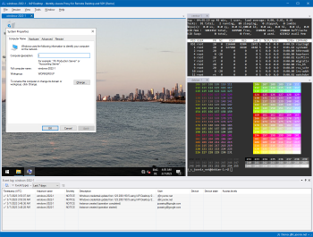
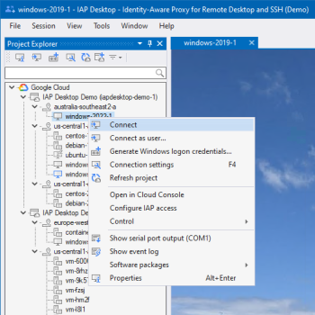
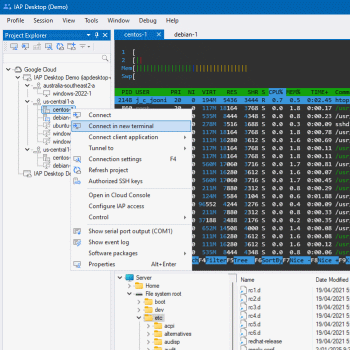
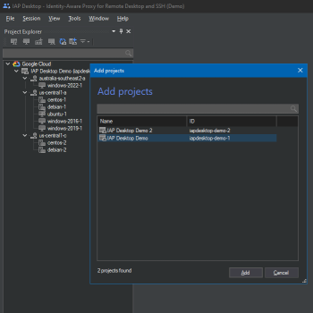
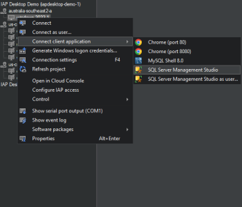

# IAP Desktop

IAP Desktop is an open-source Remote Desktop and SSH client that lets you connect to your Google Cloud VM instances from anywhere.

[Download IAP Desktop](https://github.com/GoogleCloudPlatform/iap-desktop/releases/latest/download/IapDesktopX64.msi){ .md-button }

[x86 (32-bit)](https://github.com/GoogleCloudPlatform/iap-desktop/releases/latest/download/IapDesktopX86.msi) | 
[x64 (64-bit)](https://github.com/GoogleCloudPlatform/iap-desktop/releases/latest/download/IapDesktopX64.msi). 
For Windows 10 and 11. No admin rights required.

## Access Linux and Windows VMs from anywhere

[{ align=right }](images/screenshots/Overview_1400.png?raw=true)

IAP Desktop uses [Identity-Aware-Proxy (IAP) :octicons-link-external-16:](https://cloud.google.com/iap/docs/tcp-forwarding-overview) to connect to VM instances so that you can:

*   Connect to VM instances that don’t have a public IP address
*   Connect from anywhere over the internet

Together, IAP Desktop and IAP let you apply zero-trust security to your VMs:

*   Apply fine-grained access controls that define 
    [who can access which VM :octicons-link-external-16:](https://cloud.google.com/iap/docs/using-tcp-forwarding#configuring_access_and_permissions)
*   Use [access levels :octicons-link-external-16:](https://cloud.google.com/iap/docs/cloud-iap-context-aware-access-howto) to restrict access by time or location
*   Use [BeycondCorp Enterprise :octicons-link-external-16:](https://cloud.google.com/beyondcorp-enterprise) to limit access to trusted devices

The application automatically manages IAP TCP tunnels for you, and protects them so that no other users or programs can access them.

## Connect to Windows VMs with Remote Desktop

[{ align=right }](images/screenshots/RemoteDesktop_1400.gif?raw=true)

IAP Desktop is a [full-featured Remote Desktop client](connect-windows.md) that lets you:

*   Use multiple Remote Desktop sessions at the same time
*   Switch between full-screen and tabbed Remote Desktop sessions
*   Upload and download files over SFTP

To help you authenticate to Windows VMs, IAP Desktop can:

*   Automatically generate Windows credentials by using the Compute Engine guest agent environment
*   Encrypt and store your Windows credentials locally

:material-movie-play: [Show screencast](images/screenshots/RemoteDesktop_1400.gif?raw=true)

## Connect to Linux VMs with SSH

[{ align=right }](images/screenshots/SSH_1400.gif?raw=true)

IAP Desktop [includes an SSH client and terminal](connect-linux.md) so that you can:

*   Use multiple SSH sessions in parallel, and switch between them using tabs
*   Upload and download files using SFTP

To help you authenticate to Linux VMs, IAP Desktop can:

*   Automatically create and publish SSH keys to [OS Login :octicons-link-external-16:](https://cloud.google.com/compute/docs/oslogin) 
    or [metadata :octicons-link-external-16:](https://cloud.google.com/compute/docs/connect/add-ssh-keys#metadata)
*   Use OS Login [2-factor authentication :octicons-link-external-16:](https://cloud.google.com/compute/docs/oslogin/set-up-oslogin)
*   Store our SSH keys locally using Windows CNG

:material-movie-play: [Show screencast](images/screenshots/SSH_1400.gif?raw=true)

## Manage VMs across projects

[{ align=right }](https://github.com/GoogleCloudPlatform/iap-desktop/blob/master/doc/images/Manage_1400.gif?raw=true)

IAP Desktop gives you a consolidated view of your VMs and lets you:

*   Connect to VMs across multiple projects and Google Cloud organizations
*   View diagnostics information such as [audit events](toolwindow-instance-properties.md)
    and [serial port output](toolwindow-serial-port-output.md).
*   Remotely join a VM to Active Directory 
*   Perform other common operations such as starting or stopping VMs

:material-movie-play: [Show screencast](images/screenshots/Manage_1400.gif?raw=true)

   

## Connect to SQL Server and other server applications

[{ align=right }](images/screenshots/Client_700.png?raw=true)

You can use IAP Desktop to let client applications connect to your Google Cloud VMs through IAP:
Right-click a VM, select the application to launch, and IAP Desktop automatically connects the
application through an IAP TCP forwarding tunnel. 

Supported client applications include:

*   [SQL Server Management Studio](connect-sqlserver.md) (supporting Windows authentication and SQL Server authentication)
*   MySQL Shell
*   Chrome (to connect to management portals and other internal websites)
*   [Custom applications](client-application-configuration.md)

Instead of letting IAP Desktop launch a client application for you, you can use port forwarding
and connect the application to the forwarded port yourself.