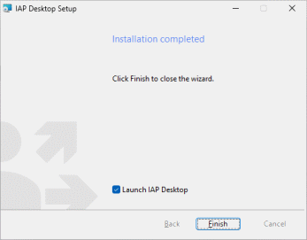
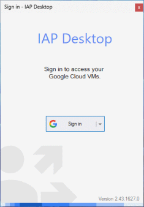

???+ success "Prerequisites"

    To follow the steps in this section, make sure that you meet the following prerequisites:

    *   [ ] You're using Windows 10, Windows Server 2019, or higher.
    *   [ ] Your computer has internet access (direct or via a [proxy server](proxy-configuration.md)).

    You do not need admin rights [unless you install on Windows Server](troubleshooting.md). 

To download install IAP Desktop on your computer, do the following:

1.  Download the latest installer package:

    [Download IAP Desktop](https://github.com/GoogleCloudPlatform/iap-desktop/releases/latest/download/IapDesktop.msi){ .md-button }

1.  Double-click the downloaded `IapDesktop.msi` and follow the steps of the installation wizard.
1.  On the last page, click **Finish** to launch IAP Desktop:

    

## Connect to Google Cloud

When you first launch IAP Desktop, you see the Sign-in dialog:

=== "Google user account"

    To sign in with your Google user account (Cloud Identity, Workspace, Gmail or other), do
    the following:

    1.  On the Sign-in dialog, click **Sign in**.
    1.  Follow the steps in the web browser to sign in with your Google user account.    
    1.  On the **IAP Desktop wants to access your Google account** screen,
        allow IAP Desktop to _See, edit, configure, and delete your Google Cloud data_ by setting
        the checkbox to **enabled**:
        
        
        
        ???+ Note
        
            If you don't allow IAP Desktop to access your Google Cloud data, the application
            can't connect to any of your VM instances.
        
    1.  Click **Continue** to complete the sign-in.
    1.  Close the browser tab or window.
        
=== "Workforce identity federation"    

    If your organization uses [workforce identity federation :octicons-link-external-16:](https://cloud.google.com/iam/docs/workforce-identity-federation), do
    the following to sign in:

    1.  On the Sign-in dialog, click **Sign in :material-chevron-down: > Options**.
    1.  On the **Sign-in method** dialog, select **Sign in with workforce identity federation** and
        enter the following settings:
    
        +   **Location ID**: the location of your workforce identity pool, typically `global`.
        +   **Pool ID**: the ID of your workforce identity pool.
        +   **Provider ID**: the ID of your workforce identity pool provider.
        
    1.  Click **OK**.
    1.  On the Sign-in dialog, click **Sign in**.
    1.  Follow the steps in the web browser to sign in with your corporate identity provider.
    1.  On the **Continue to Google Cloud SDK** page, click **Next** to complete the sign-in.
    1.  Close the browser tab or window.
    
For more information on troubleshooting common sign-in issues, see [Troubleshooting sign-in issues](troubleshooting-signin.md).

## Access your projects

???+ info "Required roles"

    To follow the steps in this section, you need the following roles:
    
    *   [ ] [Compute Viewer](https://cloud.google.com/compute/docs/access/iam) on the project you want to connect to.
    
    
Now that you're signed in, you can access your Google Cloud projects:
    
1.  In the **Add project** dialog, select your Google Cloud project and click **Add project**.
    
    
    
1.  Select one or more projects and click **Add**.
    
    The **Project Explorer** now shows the project and all VM instances that the project contains:
    
    
    
1.   Optionally, click **Profile > Add project** in the menu to add additional projects.

You're now ready to [connect to a Windows VM](connect-windows.md) or a [Linux VM](connect-linux.md). 

## Frequently Asked Questions

### Do I need to install the Cloud SDK to use IAP Desktop?

No, IAP Desktop does not depend on the Cloud SDK or `gcloud`.

### Do I need local admin rights to install IAP Desktop on my machine?

No, IAP Desktop can be installed without admin rights unless you are installing
on a Windows Server system. 

Windows Server doesn't allow per-user installations by default. See 
[Troubleshooting](troubleshooting.md) for details on how to install IAP Desktop on Windows Server.

### Is IAP Desktop compatible with App Locker?

Yes, the IAP Desktop installation package and all binaries are signed and are
compatible with [App Locker publisher conditions :octicons-link-external-16:](https://learn.microsoft.com/en-us/windows/security/application-security/application-control/windows-defender-application-control/applocker/understanding-the-publisher-rule-condition-in-applocker).

## What's next

*   [Set up IAP in your project](setup-iap.md) so that you and other users can connect to VMs.
*   See how you can [connect to Windows VMs by using RDP](connect-windows.md)
*   See how you can [connect to Linux VMs by using SSH](connect-linux.md)
