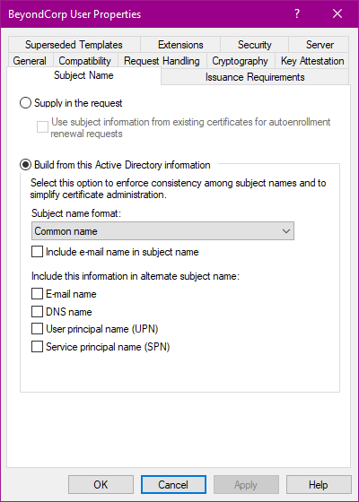
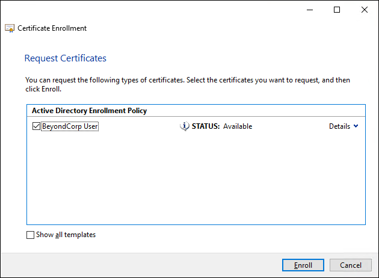
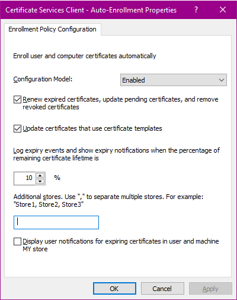

# Deploy certificates using Active Directory Certificate Services

## Configure Chrome

1.  Configure Chrome [to automatically enroll in Chrome browser management](https://support.google.com/chrome/a/answer/9301891?hl=en#zippy=%2Cenroll-browsers-on-windows)
1.  Use Chrome browser management to [deploy Endpoint Verification](https://cloud.google.com/endpoint-verification/docs/quickstart)

## Configure Active Directory

You can configure [certificate-based access](setup-caa-with-a-beyondcorp-certificate-access-policy)
so that it used certificates issued by Active Directory Certificate Services.

This guide describes how to configure Active Directory Certificate Services to issue
suitable certificates.

### Create a certificate template

...Although it's possible to let BeyondCorp use certificates from an existing template,
it's best to create a dedicated template for BeyondCorp.

...use settings that help prevent the cert from being abused for other purposes such as Kerberos auth.

To create the certificate template, do the following:

{ width="250", align=right }

1.  Open the **Certificate Templates** MMC snap-in.
1.  Right-click the **User** template and select **All tasks > Duplicate template**.
    
1.  On the **Compatibility** tab, configure the following settings:

    *   **Certificate authority**: **Windows Server 2012** or a later version
    *   **Certificate recipient**: **Windows 8/Windows Server 2012** or a later version
    
1.  On the **General** tab, configure the following settings:

    *   **Template display name**: Enter a name such as `BeyondCorp User`
    *   **Validity period**: Select a validity period that suits your requirements
    *   **Publish certificate in Active Directory**: **disabled**
    
1.  On the **Request handling** tab, configure the following settings:

    *   **Purpose**: **Signature**
    *   **Allow private key to be exported**: **disabled**
    
1.  On the **Cryptography** tab, configure the following settings:

    *   **Provider category**: **Key Storage Provider**
    *   **Algorithm name**: **RSA**
    *   **Request hash**: **SHA256**
    
    These settings instruct Windows workstations to store private keys using 
    a [CNG key storage provider :octicons-link-external-16:](https://learn.microsoft.com/en-us/windows/win32/seccng/key-storage-and-retrieval)
    as opposed to a legacy cryptography provider.
    
    Optionally, you can force workstations to use a specific CNG key storage provider
    that [uses a Trusted Platform Module :octicons-link-external-16:](https://techcommunity.microsoft.com/t5/core-infrastructure-and-security/setting-up-tpm-protected-certificates-using-a-microsoft/ba-p/1129055)
    to protect private keys:

    1.   Click **Requests must use one of the following providers**
    2.   Set **Microsoft Platform Crypto Provider** to **Enabled**
    3.   Set all other providers to **disabled**
    

1.  On the **Subject name** tab, select **Build from Active Directory information** and 
    configure the following settings:

    *   **Subject name format**: **Common name**
    *   **Include e-mail name in subject name**: **disabled**
    *   **E-mail name**: **disabled**
    *   **DNS name**: **disabled**
    *   **User principal name**: **disabled**
    *   **Service principal name**: **disabled**

    These settings help limit the risk of bad actors abusing the certificate for other purposes
    such as smart card authentication. 
    
    For further details on how Windows determines whether
    a certificate can be used for smart card authentication, see 
    [Client certificate mappings :octicons-link-external-16:](https://learn.microsoft.com/en-us/previous-versions/windows/it-pro/windows-server-2008-R2-and-2008/ff404289(v=ws.10)#client-certificate-mappings).
    For additional ways to mitigate risks, see [How to disable the Subject Alternative Name for UPN mapping :octicons-link-external-16:](https://learn.microsoft.com/en-us/troubleshoot/windows-server/windows-security/disable-subject-alternative-name-upn-mapping).

1.  On the **Extensions** tab, select **Application Policies** and click **Edit**.

    In the **Edit Application Policies Extension** dialog, 
    remove all policies except for **Client authentication**.
    Then click **OK**.
        
1.  On the **Security** tab, select one or more groups that you want to
    distribute the certificate to. Grant each group the following permissions:
    
    *   Read
    *   Enroll
    *   Autoenroll

1.  Click **OK**.

### Issue the Certificate

...use the template to issue certs

1.  Open the **Certificate Authority** MMC snap-in.
1.  Right-click the **Certificate Templates** folder and select **New > Certificate template to issue**.
1.  Select the `BeyondCorp User` certificate template that you created in the previous step and click **OK**.

You can now manually request certificates on domain-joined workstations by doing the following:

1.  Log in as a domain users.
1.  Open the **Certificate management** MMC snap-in (`certmgr.msc`)
1.  Rich-click the **Personal** folder and select **All tasks > Request new certificate...**.
1.  On the **Before you begin** page, click **Next**.
1.  On the **Select certificate enrollment policy** page, select **Active Directory Enrollment policy** and  click **Next**.
1.  On the **Request certificates** page, select the `BeyondCorp User` certificate template:

    { width="350" }
    
1.  Click **Enroll**.

### Set up certificate auto-enrollment

You can automate the process of requesting certificates by configuring auto-enrollment
using a group policy object (GPO):

1.  Open the **Group Policy Management Console** MMC snap-in.
1.  Select the organizational unit that contains the user accounts for which you want to
    enable auto-enrollment.
1.  Right-click the organizational unit and select **Create GPO in this domain and link it here**.
1.  In the **New GPO** dialog, enter a name such as `BeyondCorp certificate enrollment`  and click **OK**.
1.  Right-click the GPO and select **Edit**.

Configure the GPO as follows:

{ width="250", align=right }

1.  Navigate to **User Configuration > Policies > Windows Settings > Security settings > Public key policies**
1.  Open the **Certificate Services Client - Auto-Enrollment** policy.
1.  Configure the following settings:

    *   **Configuration model**: **Enabled**.
    *   **Renew expired certificates, update pending certificates, and remove revoked certificates**: **enabled**
    *   **Update certificates that use certificate templates**: **enabled**
    
1.  Click **OK**.

It might take some time before the group policy takes effect on user's workstations. To force
a group policy refresh, run `gpupdate /force`.

### Configure certificate selection

..automatically select the certificate

1.  Make sure you've [installed the Chrome policy templates](https://support.google.com/chrome/a/answer/187202?hl=en#zippy=%2Cwindows).
1.  Open the **Group Policy Management Console** MMC snap-in.
1.  Select the organizational unit that contains the user accounts for which you want to
    enable auto-enrollment.
1.  Right-click the organizational unit and select **Create GPO in this domain and link it here**.
1.  In the **New GPO** dialog, enter a name such as `Chrome Browser Nanagement`  and click **OK**.
1.  Right-click the GPO and select **Edit**.

Configure the GPO as follows:

1.  Navigate to **User configuration > Policies > Administrative templates > Google > Google Chrome > Content settings**.
1.  Double-click **Automatically select client certificates for these sites**.
1.  Set the policy to **Enabled**.
1.  In the **Options** pane, click **Show**.
1.  In the **Show contents** dialog, add two entries:

    *   `{"pattern":"https://[*.]clients6.google.com","filter":{"ISSUER":{"CN":"COMMON-NAME"}}}`
    *   `{"pattern":"https://console-secure.cloud.google.com","filter":{"ISSUER":{"CN":"COMMON-NAME"}}}`

    Replace `COMMON-NAME` with the common name of the AD CS certificate, for example `Corp Subordinate CA`.

1.  Click **OK**.
1.  Click **OK**.

Again, it might take some time before the group policy takes effect on user's workstations. To force
a group policy refresh, run `gpupdate /force`. To verify that the polict has been applied on a workstation,
you can do the following:

1.  Open Chrome.
1.  Navigate to `chrome://policy`.
1.  Verify that the **AutoSelectCertificateForUrls** policy is listed under **Chrome policies**.

### Upload the certificate

1.  In the Google Admin console, go to **Devices > Networks > Certificates**
1.  Select the organizational unit for which you want to configure certificate-based authentication.
1.  Click **Certificates**.
1.  On the **Certificates** page, do the following:

    1.  Click **Add Certificate** and upload the certificate of your AD CS server.
    1.  Under **Certificate Authority**, set **Endpoint Verification** to **enabled**
    1.  Click **Add**.
    