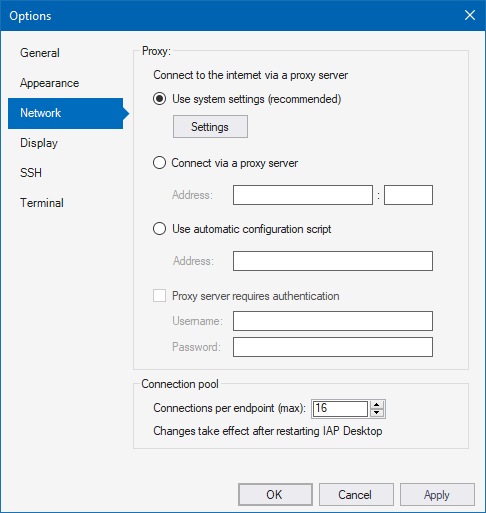

# Proxy Configuration

You can configure IAP Desktop to use a proxy server to access Google Cloud APIs.

IAP Desktop supports 3 ways to configure proxy server settings:

1.  **System** (_Use system settings_): IAP Desktop
    obtains proxy server settings from Windows. You can change these settings by using
    the Windows control panel.
2.  **Manual**: Explicitly provide a server name and port to use as HTTPS
    proxy server.
3.  **Auto-config**: Specify a URL to a proxy autoconfiguration (PAC) file.
    IAP Desktop downloads and evaluates the file and applies proxy settings accordingly.

When you use (2) or (3), you can optionally specify a username and password if your
proxy server requires authentication. IAP Desktop supports Kerberos, NTLM, and Basic for
proxy authentication.

All proxy server settings can be viewed
and modified under **Tools > Options > Network**:

## Filtering and TLS inspection

If your organization uses a proxy server that performs filtering or TLS inspection, 
some additional configuration might be required to allow users to use IAP Desktop.

### Proxy CA certificates

IAP Desktop uses the Windows _Trusted Root Certification Authorities Certificate Store_
for verifying TLS certificates. If your proxy server performs TLS inspection and therefore
re-encrypts traffic, make sure to add the proxy server's CA certificate to this
certificate store.

### Allow-list for domains accessed by IAP Desktop

To let IAP Desktop communicate with Google Cloud APIs, make sure that your proxy server 
permits HTTPS connections to the following domains:

* `oauth2.googleapis.com`
* `openidconnect.googleapis.com`
* `compute.googleapis.com`
* `oslogin.googleapis.com`
* `cloudresourcemanager.googleapis.com`
* `logging.googleapis.com`
* `sts.googleapis.com`
* `tunnel.cloudproxy.app`
* `api.github.com`
* `www.google-analytics.com` (optional)

The IAP TCP forwarding tunnels that IAP Desktop uses to create SSH and RDP connections
use WebSockets. Make sure that your proxy server permits WebSocket communication to the following domain:

* `tunnel.cloudproxy.app`

???+ Note
    Squid (and possibly other proxy servers) does not allow WebSocket
    connections when configured to perform TLS inspection (_bumping_). To allow
    WebSocket communication, exclude `tunnel.cloudproxy.app` from TLS termination
    by letting Squid [splice :octicons-link-external-16:](https://wiki.squid-cache.org/Features/SslPeekAndSplice)
    connections to this domain.

## BeyondCorp certificate-based access

When you enable BeyondCorp certificate-based access, IAP Desktop uses mutual TLS (mTLS) for all
Google APIs and for IAP TCP forwarding. 

mTLS is not compatible with TLS inspection. If you're using a proxy server that terminates and
inspects TLS traffic, configure it to exclude the following domains from TLS inspection:

* `oauth2.mtls.googleapis.com`
* `compute.mtls.googleapis.com`
* `oslogin.mtls.googleapis.com`
* `cloudresourcemanager.mtls.googleapis.com`
* `logging.mtls.googleapis.com`
* `mtls.tunnel.cloudproxy.app`
* `sts.mtls.googleapis.com`

???+ Note
    If you use Squid, you can exclude domains from inspection by 
    configuring them to use [splicing :octicons-link-external-16:](https://wiki.squid-cache.org/Features/SslPeekAndSplice)
    instead of _bumping_.
