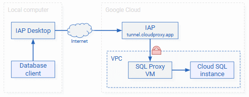

# Set up a Cloud SQL Proxy VM

???+ info "Required roles"

    To follow the steps in this guide, you need the following roles:
    
    *   [ ] [Compute Admin](https://cloud.google.com/compute/docs/access/iam) or
        [Compute Security Admin](https://cloud.google.com/compute/docs/access/iam) on the project.

To let IAP Desktop connect to Cloud SQL, you need an additional VM that runs the
[Cloud SQL Auth Proxy :octicons-link-external-16:](https://cloud.google.com/sql/docs/mysql/sql-proxy). This VM is necessary
because IAP-TCP doesn't support creating tunnels to managed services such as Cloud SQL.

This guide describes how to do the following:

1.  Create a [container VM :octicons-link-external-16:](https://cloud.google.com/compute/docs/containers/deploying-containers) that runs
    the `cloud-sql-connectors/cloud-sql-proxy` Docker image.
1.  Grant the VM permission to access Cloud SQL.
1.  Create a firewall rule that allows IAP-TCP to connect to the VM.

## Deploy the Cloud SQL Proxy VM

To deploy a VM that [automatically runs the Cloud SQL Auth Docker image :octicons-link-external-16:](https://cloud.google.com/compute/docs/containers/deploying-containers),
do the following:

1.  Set your default [project ID :octicons-link-external-16:](https://cloud.google.com/resource-manager/docs/creating-managing-projects):

        gcloud config set project PROJECT_ID
    
    Replace `PROJECT_ID` with the ID of your Cloud SQL project.

1.  Set your default zone:

        gcloud config set compute/zone ZONE
    
    Replace `ZONE` with the ID of the zone you want to deploy the VM in.

1.  Create a service account for the VM:

        SERVICE_ACCOUNT=$(gcloud iam service-accounts create cloudsql-proxy-vm --display-name "Cloud SQL Proxy VM" --format "value(email)")

1.  Allow the service account to connect to Cloud SQL by granting it the 
    _Cloud SQL Client_ role (`roles/cloudsql.client`):

        gcloud projects add-iam-policy-binding $(gcloud config get project) \
          --member "serviceAccount:$SERVICE_ACCOUNT" \
          --role "roles/cloudsql.client"

1.  Set an environment variable that contains the 
    [connection name :octicons-link-external-16:](https://cloud.google.com/sql/docs/mysql/connect-auth-proxy#start-proxy)
    of your Cloud SQL instance:

        CONNECTION_NAME=$(gcloud sql instances describe --format "value(connectionName)" SQL_INSTANCE_NAME)

    Replace `SQL_INSTANCE_NAME` with the name of your Cloud SQL instance.
 
1.  Create a [container VM :octicons-link-external-16:](https://cloud.google.com/compute/docs/containers/deploying-containers) that runs
    the `cloud-sql-connectors/cloud-sql-proxy` Docker image and attach the service account:

        gcloud compute instances create-with-container cloudsql-proxy \
          --machine-type e2-small \
          --service-account $SERVICE_ACCOUNT \
          --scopes "https://www.googleapis.com/auth/cloud-platform" \
          --no-address \
          --container-image gcr.io/cloud-sql-connectors/cloud-sql-proxy:latest \
          --container-restart-policy on-failure \
          --container-arg="--private-ip" \
          --container-arg="-a" \
          --container-arg="0.0.0.0" \
          --container-arg="$CONNECTION_NAME" \
          --network VPC_NAME \
          --subnet SUBNET

    Replace the following:

    +   `VPC_NAME`: the name of your VPC network
    +   `SUBNET`: the name of the subnet to deploy the VM into.

    The command configures the Cloud SQL Auth Proxy to listen on `0.0.0.0` (as opposed to `127.0.0.1`).
    This is necessary so that IAP-TCP can connect to the Cloud SQL Auth Proxy from over the network. 

    The VM doesn't have an external IP, because it's only intended to be access from IAP-TCP.

1.  Create a firewall rule that allows IAP-TCP to connect to the VM:

        gcloud compute firewall-rules create allow-sql-ingress-from-iap \
            --direction INGRESS \
            --action allow \
            --target-service-accounts $SERVICE_ACCOUNT \
            --source-ranges 35.235.240.0/20 \
            --network VPC_NAME \
            --rules tcp:PORT

    Replace the following:

    +   `VPC_NAME`: the name of your VPC network
    +   `PORT`: the port of the database, for example:

        +    SQL Server: `1433`
        +    MySQL: `3306`
        +    PostgreSQL: `5432`

You can now use IAP Desktop to connect to `cloudsql-proxy`, and the VM forwards
connections to your Cloud SQL instance.