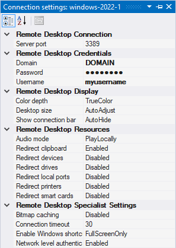
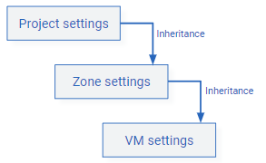

# Connection settings window
{ align=right }

The **Connection settings** window lets you customize how IAP Desktop connects
to your VMs. You can configure connection settings for individual VMs or entire zones or projects.

Connection settings support inheritance: If you configure a connection setting for a project,
this setting applies to all zones and VMs in the project. Similarly, if you configure a 
connection setting for a zone, it applies to all VMs in that zone:

You can override inherited settings at lower levels. Whenever a setting deviates
from the (inherited) default, its value is shown in bold typeface.

Connection settings are stored on your local computer and don't
affect the configuration of the remote VM.

## Windows Credentials

These settings control which user account you log on with. If you don't configure Windows credentials,
IAP Desktop might prompt you for credentials when you first try to connect.

You can use the following types of user accounts:

* a local Windows user account
* an Active Directory user account

The user account must have permission to use Remote Desktop. Typically, this requires that the user is either
a member of the _Administrators_ group or the _Remote Desktop users_ group.

<table>
    <tr>
        <th>Setting</th>
        <th>Description</th>
        <th>Required</th>
    </tr>
    <tr>
        <td>Username</td>
        <td>Username or UPN, for example <code>bob</code> or <code>bob@example.com</code>.</td>
        <td>No</td>
    </tr>
    <tr>
        <td>Password</td>
        <td>Account password</td>
        <td>No</td>
    </tr>
    <tr>
        <td>Domain</td>
        <td> 
            <ul>
                <li>Leave blank if you're using an UPN as username</li>
                <li>Use the NetBIOS domain name if the username is a NetBIOS username</li>
                <li>Use <code>.</code> if you're using a local Windows user account</li>
            </ul>
        </td>
        <td>No</td>
    </tr>
</table>

## Remote Desktop Connection

These settings control how IAP Desktop connects to your VM. You can let IAP Desktop connect in one
of two ways:

*   **IAP Tunnel**: By default, IAP Desktop connects to the [internal IP address :octicons-link-external-16:](https://cloud.google.com/compute/docs/ip-addresses#networkaddresses)
    of your VM [through an IAP-TCP forwarding tunnel :octicons-link-external-16:](https://cloud.google.com/iap/docs/using-tcp-forwarding).
*   **VPN/Interconnect**: Alternatively, you can let IAP Desktop connect to the VM's internal IP address through Cloud VPN or Interconnect. If you use this option, 
    IAP Desktop doesn't use IAP-TCP forwarding.
    
<table>
    <tr>
        <th>Setting</th>
        <th>Description</th>
        <th>Default</th>
    </tr>
    <tr>
        <td>Connect via</td>
        <td>Controls how IAP Desktop connects to your VM, see description above.</td>
        <td></td>
    </tr>
    <tr>
        <td>Connection timeout</td>
        <td>Timeout for connecting to the VM, in seconds.</td>
        <td>30 seconds</td>
    </tr>
    <tr>
        <td>Server port</td>
        <td>Port to connect to.</td>
        <td><code>3389</code></td>
    </tr>
</table>

## Remote Desktop Display

These settings control the display settings for Remote Desktop.

<table>
    <tr>
        <th>Setting</th>
        <th>Description</th>
        <th>Default</th>
    </tr>
    <tr>
        <td>Color depth</td>
        <td>Color depth to use.</td>
        <td>True color (24-bit)</td>
    </tr>
    <tr>
        <td>Connection bar</td>
        <td>Controls the behavior of the connection bar that's shown when you set the Remote Desktop session to full-screen.</td>
        <td>Auto hide</td>
    </tr>
    <tr>
        <td>Display resolution</td>
        <td>
            Controls the screen resolution and size of the remote desktop.
            <ul>
                <li><b>Adjust automatically</b>: Adjust the size and resolution to fit the IAP Desktop window.</li>
                <li><b>Same as this computer</b>: Use the same size and resolution as the current monitor on your local computer.</li>
            </ul>
        </td>
        <td>Adjust automatically</td>
    </tr>
    <tr>
        <td>Display scaling</td>
        <td>
            Controls whether to scale the size of texts, fonts, and apps on the remote desktop.
            <ul>
                <li><b>Same as this computer</b>: Use the same scaling setting as your local computer.</li>
                <li><b>Disabled (100%)</b>: Disable scaling and show  texts, fonts, and apps at their regular size.</li>
            </ul>
        </td>
        <td>Disabled (100%)</td>
    </tr>
</table>

## Remote Desktop Resources

These settings control which local and remote resources you want to share.

<table>
    <tr>
        <th>Setting</th>
        <th>Description</th>
        <th>Default</th>
    </tr>
    <tr>
        <td>Audio playback</td>
        <td>Controls where to play back audio.</td>
        <td>Play on this computer</td>
    </tr>
    <tr>
        <td>Microphone</td>
        <td>Share default input device so that you can use it on the remote VM.</td>
        <td>Don't share</td>
    </tr>
    <tr>
        <td>Windows shortcuts</td>
        <td>Controls whether IAP Desktop redirects Windows shortcuts (such as <code>Win+R</code>) to the VM:
            <ul>
                <li><b>Don't redirect</b>: Don't redirect shortcuts and handle them locally instead.</li>
                <li><b>Redirect to remote VM</b>: Always redirect shortcuts and handle them remotely.</li>
                <li><b>Redirect in full-screen</b>: Only redirect shortcuts when the Remote Desktop session is in full-screen mode.</li>
            </ul>
        </td>
        <td>Only in full-screen mode</td>
    </tr>
    <tr>
        <td>Clipboard</td>
        <td>Share clipboard contents between your local computer and the remote VM.</td>
        <td>Share</td>
    </tr>
    <tr>
        <td>Printers</td>
        <td>Share local printers so that you can use them on the remote VM.</td>
        <td>Don't share</td>
    </tr>
    <tr>
        <td>Smart cards</td>
        <td>Share smart cards so that you can use them on the remote VM.</td>
        <td>Don't share</td>
    </tr>
    <tr>
        <td>Local ports</td>
        <td>Share local ports (COM, LPT) so that you can access them on the remote VM.</td>
        <td>Don't share</td>
    </tr>
    <tr>
        <td>Drives</td>
        <td>Share local drives so that you can access them on the remote VM.</td>
        <td>Don't share</td>
    </tr>
    <tr>
        <td>Plug and Play devices</td>
        <td>Share local Plug and Play devices so that you can use them on the remote VM.</td>
        <td>Don't share</td>
    </tr>
    <tr>
        <td>WebAuthn authenticators</td>
        <td>Share WebAuthn authenticators and Windows Hello devices so that you can use WebAuthn on the remote VM.</td>
        <td>Share</td>
    </tr>
</table>

## Remote Desktop Security Settings

These settings control which RDP security mechanism to apply.

<table>
    <tr>
        <th>Setting</th>
        <th>Description</th>
        <th>Default</th>
    </tr>
    <tr>
        <td>Automatic logon</td>
        <td>
            Controls how IAP Desktop behaves if you haven't configured any <a href="#windows-credentials">Windows credentials</a>.

            <ul>
            <li>
                When set to <b>Enabled</b>, IAP Desktop proactively shows a credential prompt that offers a <i>Remember me</i> option
                so that it can log you in automatically the next time.
            </li>
            <li>
                When set to <b>Disabled</b>, IAP Desktop won't offer a <i>Remember me</i> option, and won't try
                to log you in automatically unless you manually configure <a href="#windows-credentials">Windows credentials</a>.
                  
                Set this to <b>Disabled</b> for VMs that use the <a href="https://admx.help/?Category=Windows_10_2016&Policy=Microsoft.Policies.TerminalServer::TS_PASSWORD">Always prompt for password upon connection</a>
                group policy setting to <a href="/iap-desktop/troubleshooting-rdp/#your-credentials-did-not-work-when-using-saved-credentials">
                prevent duplicate password prompts</a>.
            </li>
            </ul>
            The setting is automatically set to <b>Disabled</b> if your local computer is subject to the 
            <a href="https://admx.help/?Category=Windows_10_2016&Policy=Microsoft.Policies.TerminalServer::TS_CLIENT_DISABLE_PASSWORD_SAVING_2">
            Do not allow passwords to be saved</a> group policy. 
        </td>
        <td>See description</td>
    </tr>
    <tr>
        <td>Network level authentication</td>
        <td>
            Controls whether to secure connection using <a href='https://learn.microsoft.com/en-us/windows-server/remote/remote-desktop-services/clients/remote-desktop-allow-access'>network level authentication</a>
            (NLA). 
              
            Leave NLA enabled unless you're connecting to a VM that uses a custom credential service provider such as the <a href='https://tools.google.com/dlpage/gcpw/'>Google Credential Provider for Windows</a>.
              
            Disabling NLA automatically enables server authentication.
        </td>
        <td>Enabled</td>
    </tr>
    <tr>
        <td>Restricted Admin mode</td>
        <td>
            Controls whether to use <a href='https://learn.microsoft.com/en-us/windows/security/identity-protection/remote-credential-guard?tabs=intune'>Restricted Admin mode</a>,
            which disables the transmission of reusable credentials to the VM. 
              
            To use Restricted Admin mode, you must ensure that the following prerequisites are met:
            <ul>
                <li>You're using a user account that has local administrator privileges on the VM.</li>
                <li>You've configured the VM to <a href='https://social.technet.microsoft.com/wiki/contents/articles/32905.remote-desktop-services-enable-restricted-admin-mode.aspx'>permit Restricted Admin mode</a>.</li>
            </ul>
            If you don't meet these prerequisites, connecting to the VM might fail with the error <i>Account restrictions are preventing this user from signing in</i>.
        </td>
        <td>Disabled</td>
    </tr>
    <tr>
        <td>Session type</td>
        <td>
            Controls the type of RDP session to use:
            <ul>
                <li><b>Normal user session</b>: Establishes a normal user session.</li>
                <li><b>RDS admin-session</b>: Establishes an administrative session, equivalent to running <code>mstsc /admin</code>.</li>
            </ul>
            This setting only affects VMs that operate as RDS session hosts. For further details, see 
            <a href="https://techcommunity.microsoft.com/t5/security-compliance-and-identity/changes-to-remote-administration-in-windows-server-2008/ba-p/246577">
            Changes to Remote Administration in Windows Server 2008</a>.
        </td>
        <td>Normal user session</td>
    </tr>
</table>

## SSH Connection

These settings control how IAP Desktop connects to your VM. The settings are analogous to the 
[Remote Desktop Connection](#remote-desktop-connection) settings.

## SSH Credentials

These settings control which user account you log on with, and which authentication method to use.

IAP Desktop supports the following SSH authentication methods:

*   `publickey`
*   `password`
*   `keyboard-interactive`

When you use `publickey`, IAP Desktop automatically publishes a public key to the VM, and uses the corresponding private key to authenticate.
Depending on the VM's configuration, IAP Desktop uses either [OS Login :octicons-link-external-16:](https://cloud.google.com/compute/docs/oslogin)
or [metadata keys :octicons-link-external-16:](https://cloud.google.com/compute/docs/connect/add-ssh-keys) to publish the public key.

<table>
    <tr>
        <th>Setting</th>
        <th>Description</th>
        <th>Default</th>
    </tr>
    <tr>
        <td>Public key authentication</td>
        <td>
            Controls the authentication method to use:
            
            <ul>
                <li>Enabled: Use <code>publickey</code> authentication and let IAP Desktop automatically create an SSH key and publish it using OS Login or metadata keys. </li>
                <li>Disabled: Use <code>password</code> or <code>keyboard-interactive</code>-based authentication.</li>
            </ul>
        </td>
        <td>Enabled</td>
    </tr>
    <tr>
        <td>Username</td>
        <td>
            Linux/Unix username. 
              
            This setting is ignored when using OS Login because OS Login automatically determines your username.
        </td>
        <td></td>
    </tr>
    <tr>
        <td>Password</td>
        <td>Linux/Unix password</td>
        <td></td>
    </tr>
</table>
