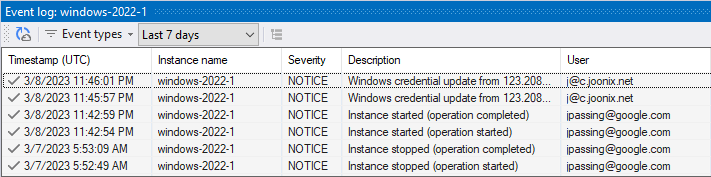

# Event log window

???+ info "Required roles"

    To use the Event log window, you need the following roles:
    
    *   [ ] [Logs Viewer :octicons-link-external-16:](https://cloud.google.com/iam/docs/understanding-roles#logging-roles) on
        the project or VM.
        
        
        
The **Event log window** lets you view certain [Cloud Audit Log :octicons-link-external-16:](https://cloud.google.com/logging/docs/audit) events, including:

*   VM access events
*   VM lifecycle events
*   VM system events

To open the Event log window, select a VM in the **Project Explorer** window and select **Show event log**.

Optionally, double-click an event to view details in the [Logs viewer :octicons-link-external-16:](https://cloud.google.com/tools/visual-studio/docs/log-viewer)

## VM access events

The Event log window lets you view the following VM access events:

*   IAP tunnel access
*   OS Login
*   SSH key upload
*   Windows credential generation

## VM lifecycle events

The Event log window lets you view the following VM lifecycle events:

*   Deleting an instance
*   Creating an instance
*   Stopping an instance
*   Resetting an instance
*   Suspending an instance
*   Resuming an instance

## System events

The Event log window lets you view the following VM system events:

*   Automatic restart of an instance
*   Guest OS shutdown
*   Host error
*   Instance migration due to host maintenance
*   Instance termination due to host maintenance

## What's next

* Use the [instance properties window](toolwindow-instance-properties.md)
* Try the [Serial port output window](toolwindow-serial-port-output.md)