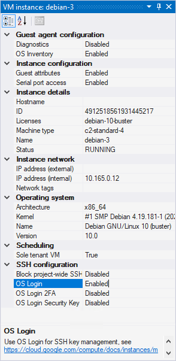

# Instance properties window

???+ info "Required roles"

    To use the Instance properties window, you need the following roles:
    
    *   [ ] [Compute Viewer :octicons-link-external-16:](https://cloud.google.com/compute/docs/access/iam) on the VM.

The **Instance properties window** lets you inspect the configuration of a VM instance, including:

{ align=right }

*   Basic information about the name and size of the VM instance
*   The internal and external IP address of the VM instance
*   Information about the operating system version and SKU deployed 
    on the VM instance. This information is obtained from 
    [OS inventory management :octicons-link-external-16:](https://cloud.google.com/compute/docs/instances/os-inventory-management)
*   An indication whether the VM is running on a [sole-tenant node :octicons-link-external-16:](https://cloud.google.com/compute/docs/nodes/sole-tenant-nodes)

To open the Instance properties window, select a VM in the **Project Explorer** window and select **Properties**.

???+ Note

    Some of the information shown by the Instance properties window is only available when
    you [enable guest attributes and OS inventory management :octicons-link-external-16:](https://cloud.google.com/compute/docs/instances/view-os-details#enable-guest-attributes).

## What's next

* Use the [Event log window](toolwindow-eventlog.md)
* Try the [Serial port output window](toolwindow-serial-port-output.md)