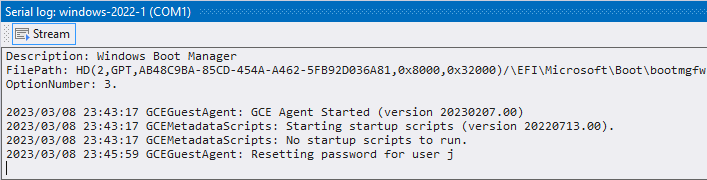

# Serial port output window

???+ info "Required roles"

    To use the Serial port output window, you need the following roles:
    
    *   [ ] [Compute Viewer :octicons-link-external-16:](https://cloud.google.com/compute/docs/access/iam) on the VM.

The **Serial port output window** lets you view the 
[serial port output :octicons-link-external-16:](https://cloud.google.com/compute/docs/troubleshooting/viewing-serial-port-output)
of a VM.

You can use the serial port window for the following serial ports:

*   **Serial port 1** (COM1): This port contains boot output as well as diagnostic information emitted by
    [agents :octicons-link-external-16:](https://cloud.google.com/compute/docs/images/guest-environment)
*   **Serial port 3** (COM3): This port is commonly used by Windows Setup when 
    [performing in-place upgrades of Windows Server :octicons-link-external-16:](https://cloud.google.com/compute/docs/tutorials/performing-in-place-upgrade-windows-server)
*   **Serial port 4** (COM4): This port is used by agents to communicate with tools, for example when 
    [creating a Windows user account :octicons-link-external-16:](https://cloud.google.com/compute/docs/instances/windows/creating-passwords-for-windows-instances)

To open the Serial port output window for port 1, select a VM in the **Project Explorer** window and 
select **Show serial port output (COM1)**. To view other ports, select **View** > **Serial port output** in the main menu 
and select the serial port to view.

## What's next

* Use the [instance properties window](toolwindow-instance-properties.md)
* Try the [Event log window](toolwindow-eventlog.md)