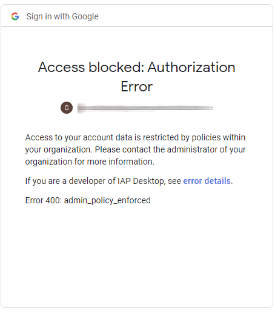
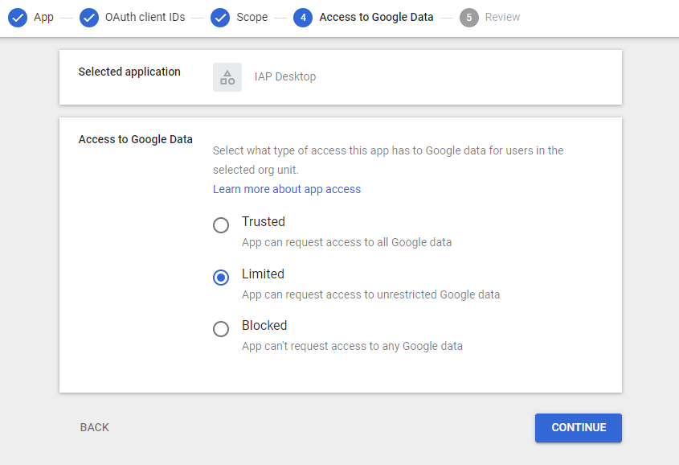
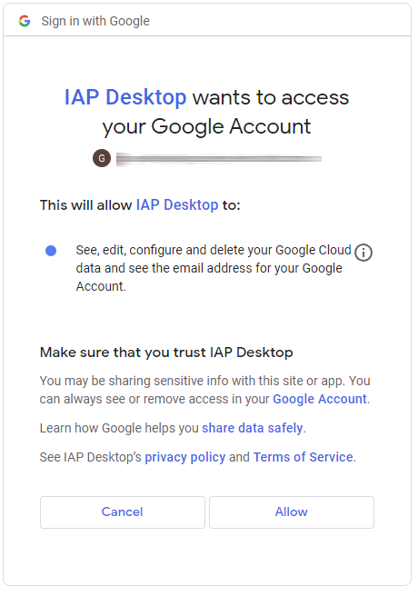

#  Troubleshooting sign-in issues

## :material-message-alert:  "Access blocked: Authorization Error"

**Symptom**: Signing in to IAP Desktop fails with the error message "Access blocked: Authorization Error"
and an error code `admin_policy_enforced`.

When you sign in to IAP Desktop, the application requests your permission to access Google Cloud on your behalf. 
IAP Desktop needs this permission so that it can list and connect to your VM instances. After you've
signed in, you therefore typically see a consent screen that looks similar to the following:

{ width="300" }

If instead, you see following error message, then  your Cloud Identity or Workspace administrator has 
[configured a policy :octicons-link-external-16:](https://support.google.com/a/answer/7281227) that restricts 
applications like IAP Desktop from requesting your permission to access Google Cloud resources.

{ width="300" }

As a Cloud Identity or Workspace administrator, you can fix this error by allow-listing IAP Desktop:

1.  Open the Admin Console and go to **Security > API Controls**

    [Open API Controls](https://admin.google.com/ac/owl){ .md-button }
    
1.  Select **Manage third-party app access**.

1.  Click **Add app > OAuth App Name Or Client ID**

1.  On the **App** page, paste the following OAuth client ID into the search field and click **Search**.

        78381520511-4fu6ve6b49kknk3dkdnpudoi0tivq6jn.apps.googleusercontent.com

    This client ID uniquely identifies IAP Desktop.
    
1.  On the **OAuth client IDs** page, select the client ID and click **Search**.
    
1.  On the **Scope** page, chose whether you want to allow all users in your organization to use IAP Desktop
    or only users in a specific organizational unit. Then click **Continue**.

1.  On the **Access to Google Data** page, unblock IAP Desktop:

    { width="600" }
    
    Select one of the following options:
    
    *   **Limited** (Recommended): This setting restores the default behavior for IAP Desktop users: 
        After signing in, users see the consent screen and can grant their permission for IAP Desktop to 
        access their Google Cloud resources.
    *   **Trusted**: This setting has a similar effect as **Limited**, but also enables a simplified sign-in experience: Users see a reduced 
        consent screen and can grant permission in a single click.

        { width="300" }
    
        Optionally, this setting also lets you
        [disable reauthentication :octicons-link-external-16:](https://support.google.com/a/answer/9368756)
        for IAP Desktop.
    
1.  On the **Review** page, confiirm your choice of settings and click **Finish**.

## :material-message-alert:  "This site can't provide a secure connection" 

**Symptom**: After completing the Google sign-in process, Chrome shows an error page:

<blockquote>
    This site can't provide a secure connection
     
    localhost sent an invalid response
      
    Try running Windows Network diagnostics.
      
    SSL_PROTOCOL_ERROR
</blockquote>

This error indicates an [HTTP Strict Transport Security (HSTS) :octicons-link-external-16:](https://en.wikipedia.org/wiki/HTTP_Strict_Transport_Security) issue.

You might have previously ran a web server on your local computer that instructed Chrome 
to only accept HTTPS connections from `localhost` by setting an `Strict-Transport-Security` 
header. This setting now prevents Chrome from passing the sign-in result back to IAP Desktop
over HTTP.

You can fix this error by doing the following:

1.   In Chrome, navigate to `chrome://net-internals/#hsts`
1.   Under **Delete domain security policies**, enter `localhost` and click **Delete**.

Now try signing in again:

1.   On the IAP Desktop sign-in screen, click **Cancel sign-in**.
1.   Click **Sign-in** to start a new sign-in attempt.